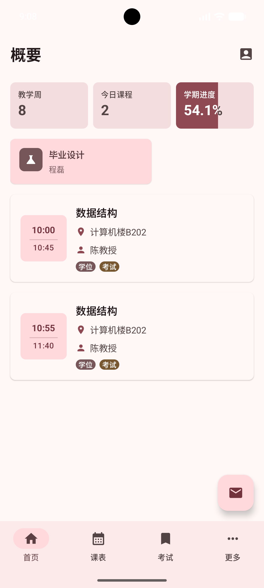
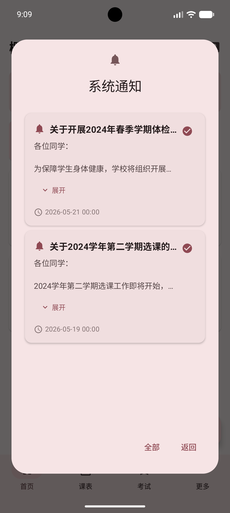
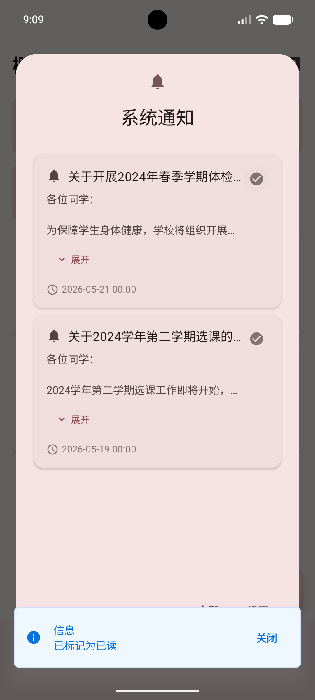

# 教务通知

教务通知页面用于查看教务系统发送的系统通知，例如调课通知、课程调整、考试相关提醒等。应用会在同步教务数据时一并获取通知，并保存到本地，方便你之后快速查看。

在首页“概要”页面中，点击右下角的“通知”按钮即可打开。

## 通知列表

打开后会看到“系统通知”窗口。页面默认优先显示未读通知，方便你先处理新的内容。

每条通知通常会展示：

- 通知标题
- 通知内容
- 发布时间
- 已读或未读状态

未读通知会更醒目一些：标题更突出，左侧通知图标也会使用主题色。已读通知则会变得更低调，方便你区分哪些已经处理过。

如果通知内容较长，页面会先显示前几行。你可以展开查看完整内容，也可以收起回到简短显示。

窗口右下角有一个切换按钮：

- 显示“全部”时，点击后会查看全部通知
- 显示“仅未读”时，点击后会回到只看未读通知

左下角的“返回”用于关闭通知窗口。

## 标记已读

每条未读通知右侧会有一个勾选按钮。点击后，应用会尝试把这条通知标记为已读。

标记成功后：

- 页面会提示“已标记为已读”
- 这条通知会在本地变为已读状态
- 如果当前只显示未读通知，它可能不再出现在当前列表中

如果标记失败，页面可能会提示“标记通知失败，请检查日志”或“由于未知原因，标记通知失败”。这时可以稍后再试，或重新同步后再操作。

## 登录失效提示

标记已读需要和教务系统通信。如果登录状态已经失效，页面会提示“登录已失效，请重新登录”，随后跳转到登录页面。

遇到这种情况时，重新登录后再同步一次数据即可。

## 常见情况

通知列表为空：可能是当前没有未读通知，可以点击“全部”查看历史通知；如果仍然为空，说明暂时没有同步到通知。

通知内容显示不完整：点击通知正文中的展开区域，查看完整内容。

调课信息和课表不一致：请以学校教务系统、学院通知或任课教师说明为准。

标记已读失败：可能是网络异常、教务系统暂时不可用，或登录状态过期。可以稍后重试。
