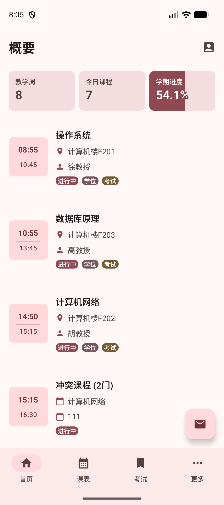
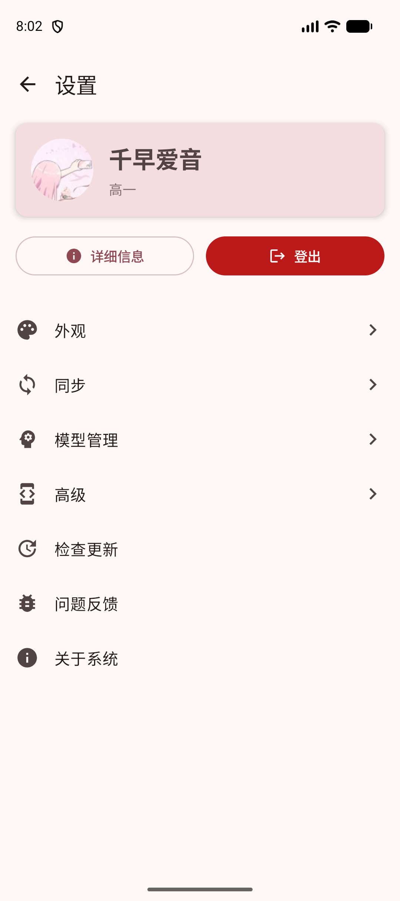
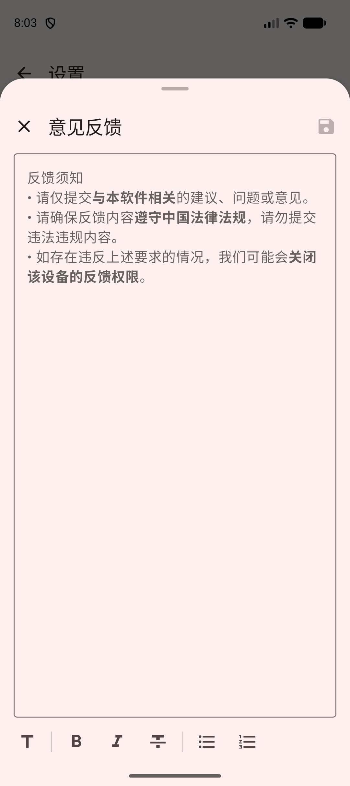
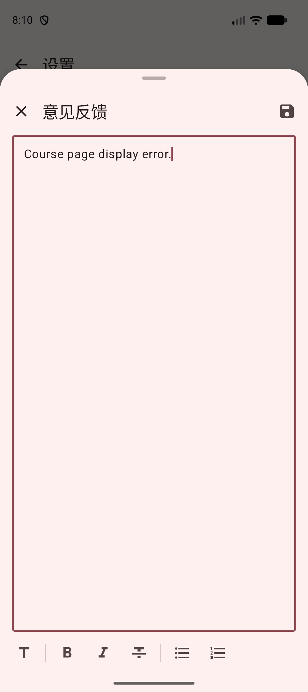
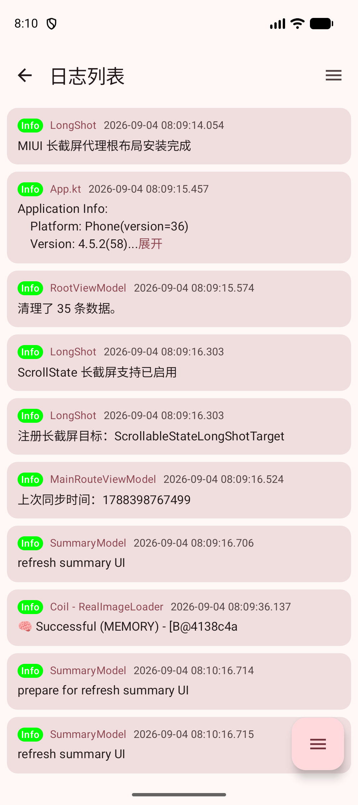
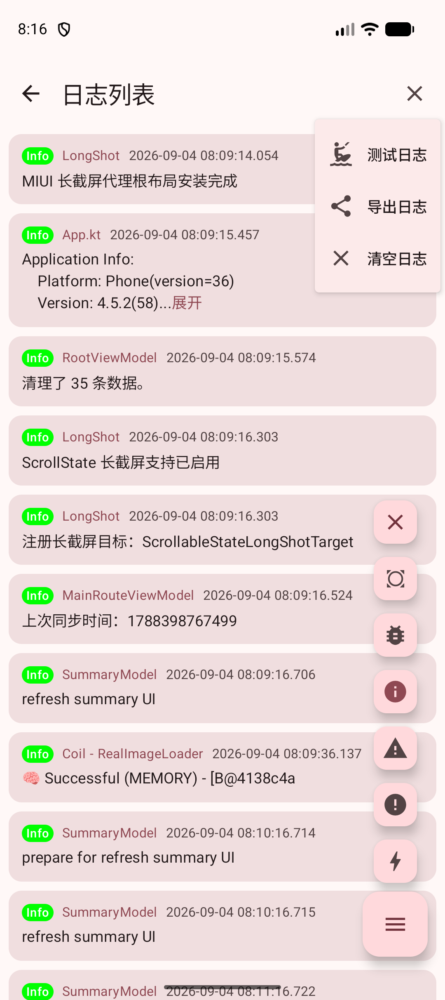
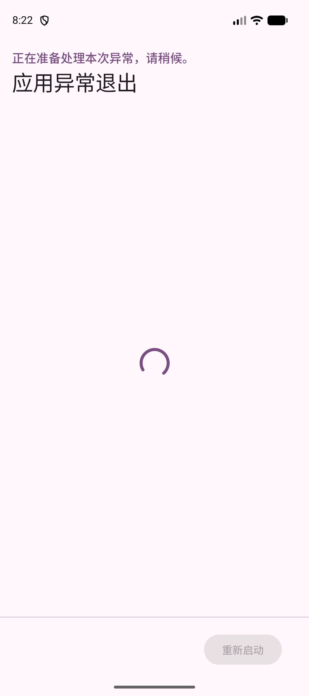
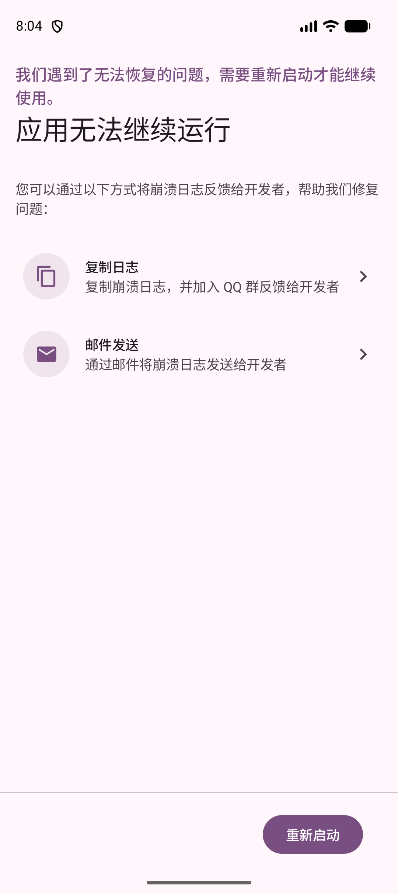
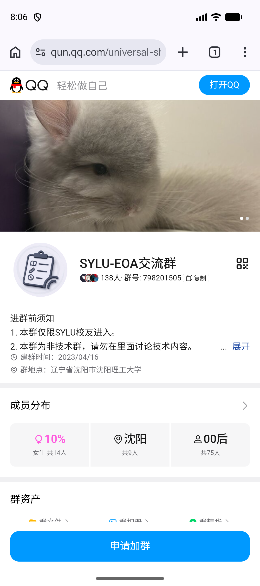

# 常见问题

## 提示“同步失败”

同步时如果看到“同步失败”，通常和当前网络、校园网访问情况或登录状态有关。可以按下面的顺序尝试，每完成一步后再重新同步一次。

1. 切换到更稳定、延迟更低的网络或 WiFi。
2. 如果方便，请在校园网环境下重新同步。
3. 退出当前账号，重新登录后再试。
4. 清除数据后重新登录，再次同步。

::: tip
同步完成前请保持网络连接。如果多次尝试后仍然失败，可以继续阅读下面的“寻求技术支持与帮助”。
:::

## 寻求技术支持与帮助

如果问题仍未解决，可以使用下面任意一种方式联系我们：

- App 还能正常打开：使用 App 内的“问题反馈”。
- App 无法打开或刚打开就崩溃：按照“崩溃处理”中的提示反馈。
- 也可以加入[官方群](https://qm.qq.com/q/heTEDas3Mk)，直接联系管理员。

### 使用 App 内反馈

App 内反馈会把问题交给开发者处理，适合反馈功能异常、页面显示错误或使用建议。

1. 在“概要”页面点击右上角的个人按钮，进入“设置”。

   

2. 在设置页面点击“问题反馈”。

   

3. App 会先准备反馈服务，请稍等片刻。准备完成后，会打开“意见反馈”页面。在输入框中写下遇到的问题。

   

   建议尽量写清楚：

   - 你当时正在使用什么功能；
   - 你做了哪些操作；
   - 页面出现了什么情况；
   - 这个问题是否每次都会出现。

   例如：“打开课表后，点击某门课程，页面没有显示课程详情。”

4. 写好后，点击右上角的保存图标提交。

   

5. 提交成功后，App 会自动打开一个 Gitee 页面。没有 Gitee 账号时，按照页面提示注册并登录；登录后可以在这个页面继续补充截图、操作步骤等信息。

::: tip 反馈小建议
请只填写与本软件有关的内容，并尽量不要在反馈中写入密码、验证码等敏感信息。
:::

::: warning 无法连接反馈服务
如果长时间无法打开反馈页面，或页面提示服务暂不可用，请稍后重试，也可以直接使用官方群反馈。
:::

### 加入官方群

点击[前往官方群](https://qm.qq.com/q/heTEDas3Mk)即可申请加入。入群后请**私聊管理员，不要私聊群主**，并简单说明：

- 遇到了什么问题；
- 在哪个页面遇到的；
- 大概什么时候发生；
- 是否可以稳定复现。

如果管理员需要更完整的运行记录，可以按下面的路径导出：

**概要页右上角个人按钮 → 高级 → 系统日志 → 右上角菜单 → 导出日志**

点击右下角按钮可以选择日志级别，从上到下分别为：**不过滤、VERBOSE、DEBUG、INFO、WARN、ERROR、ASSERT**。

日志级别越低，记录的内容越多，文件也越大，但信息会更详细。

点击右上角菜单中的“测试日志”可以新增一条测试日志。如果点击后底部没有出现新日志，请重新打开“日志列表”页面。

导出后，将日志文件发送给管理员即可。

## 崩溃处理

有时 App 可能会突然关闭。再次打开 App 时，通常会先进入一个单独的处理页面。

在正常情况下，App 会收集本次问题所需的运行环境和应用配置，并在发送前加密。这些信息用于帮助开发者定位问题；整个过程不需要你填写密码或验证码。

请保持页面打开，等待处理完成。完成后，点击“重新启动”即可回到 App。

::: tip
自动处理完成后，页面会提示问题信息已提交。之后请关注 App 的后续更新。
:::

### 自动处理失败时

如果网络不好或服务暂时不可用，自动处理可能会失败。此时页面会显示“应用无法继续运行”，并提供两种手动反馈方式：

#### 通过 QQ 群反馈

点击“复制日志”。App 会复制崩溃日志并打开 QQ 群页面。进入群后，把日志粘贴给管理员，并说明问题出现的经过。

#### 通过邮件反馈

点击“邮件发送”。App 会打开设备中的邮件应用，并自动填写崩溃日志。请检查收件人和邮件内容后发送。

不同设备的邮件应用可能显示不同；如果设备没有可用的邮件应用，可以改用 QQ 群反馈。

::: warning
发送前请确认邮件中没有你不希望分享的个人信息。是否发送邮件由你最终确认。
:::
