# 课表总览

“管理课程”页面用于查看和整理课程列表。你可以在这里查看全部课程，手动添加课程，隐藏不想显示的课程，也可以把课表保存成文件或写入手机日历。

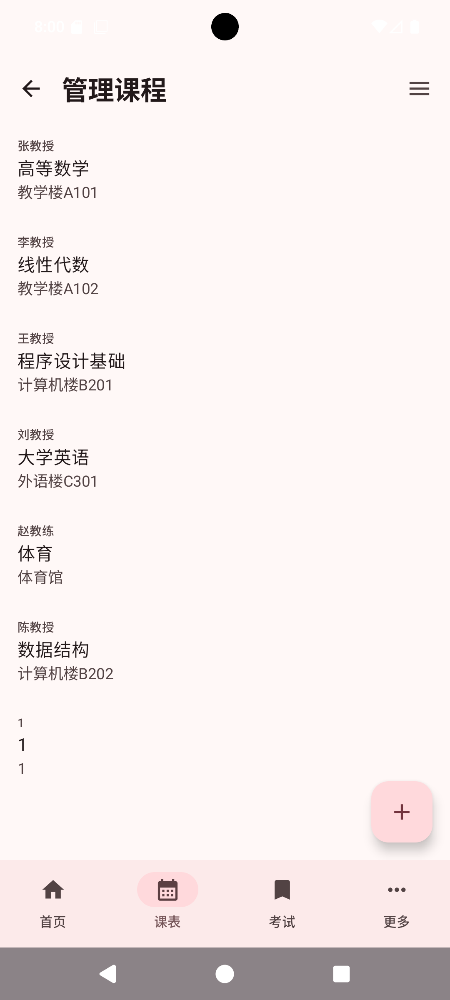

## 查看全部课程

进入“管理课程”页面后，页面会按列表展示课程。

每一项课程通常会显示：

- 任课教师
- 课程名称
- 上课地点

如果课程较多，可以上下滑动查看。点击左上角返回按钮，可以回到上一页。

## 打开管理菜单

点击右上角的菜单按钮，可以打开管理菜单。

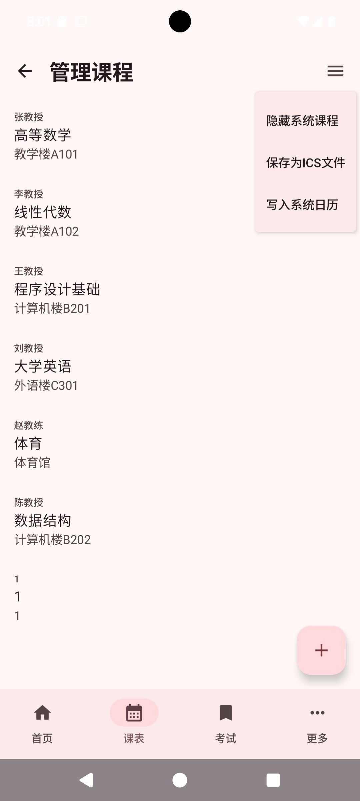

菜单中有三个常用功能：

- “隐藏系统课程”：暂时隐藏从学校课表中读取到的课程。
- “保存为ICS文件”：把课表保存成日历文件。
- “写入系统日历”：把课程加入手机自带日历。

## 隐藏系统课程

如果你只想查看自己手动添加的课程，可以点击菜单里的“隐藏系统课程”。

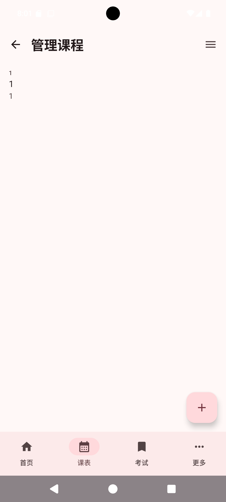

隐藏后，学校课表中的课程不会继续显示。这个操作适合临时整理视图，不代表学校课表被删除。

## 新建课程

点击右下角的“+”按钮，可以新建一门课程。

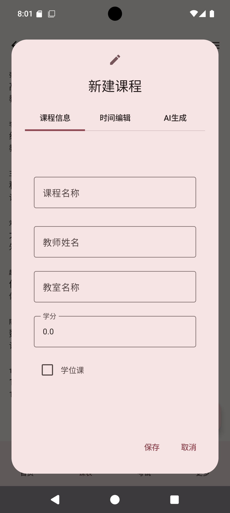

在“课程信息”里填写课程名称、教师姓名、教室名称和学分。如果这门课是学位课，可以勾选“学位课”。

接着切换到“时间编辑”，选择这门课在哪一周、星期几、第几节上课。

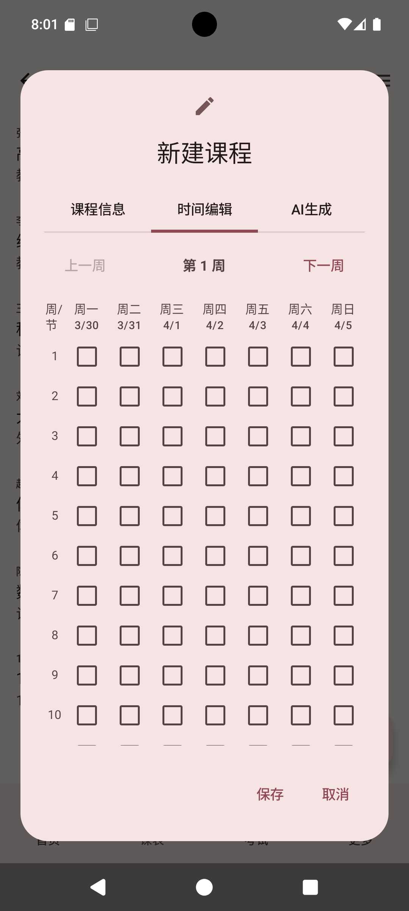

填写完成后，点击“保存”。如果不想添加，点击“取消”即可。

## 使用 AI 生成课程

新建课程窗口中还有“AI生成”页面。

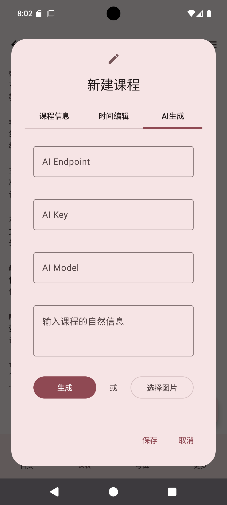

如果你有一段课程安排文字，或者有一张课程表图片，可以尝试让应用帮你整理课程信息。

你可以：

1. 输入相关信息。
2. 点击“生成”，或点击“选择图片”。
3. 检查生成出来的课程内容。
4. 确认无误后点击“保存”。

生成结果可能需要你再检查一遍，尤其是上课周次、节次和教室。

## 编辑自定义课程

在课程列表中，把课程向一侧滑动，会出现编辑按钮。

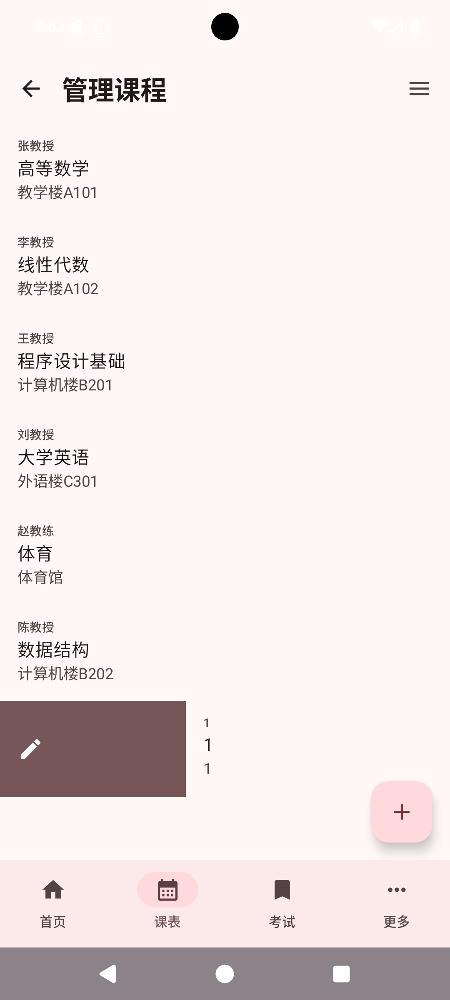

点击铅笔图标后，可以修改这门课程的信息。修改完成后点击“保存”。

## 删除自定义课程

在课程列表中，把课程向另一侧滑动，会出现删除按钮。

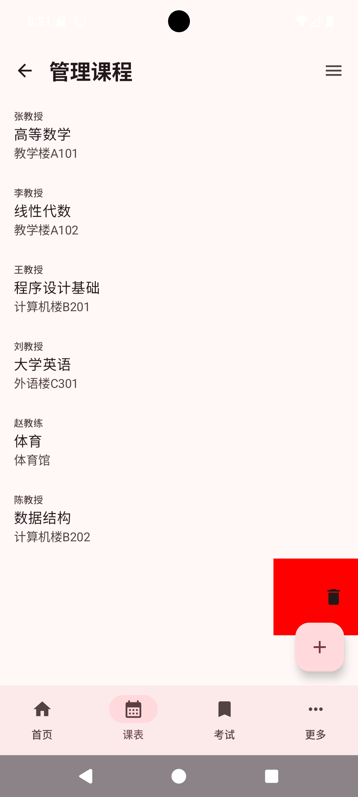

点击删除按钮后，这门自定义课程会从列表中移除。删除前请确认这门课确实不再需要。

## 保存为 ICS 文件

如果你想把课表导出给其他日历软件使用，可以点击右上角菜单，再选择“保存为ICS文件”。

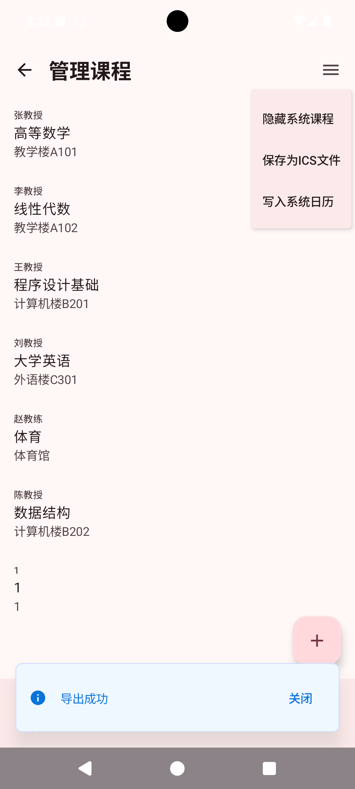

看到“导出成功”提示后，表示课表文件已经保存完成。

## 写入系统日历

如果你想让课程出现在手机自带日历中，可以点击右上角菜单，再选择“写入系统日历”。

第一次使用时，手机可能会询问是否允许应用访问日历。

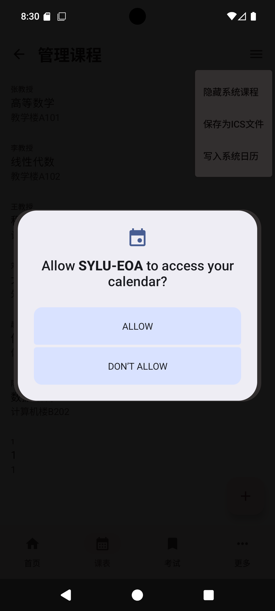

请选择允许。允许后，应用才能把课程添加到日历里。

如果没有授予权限，会看到权限提示。

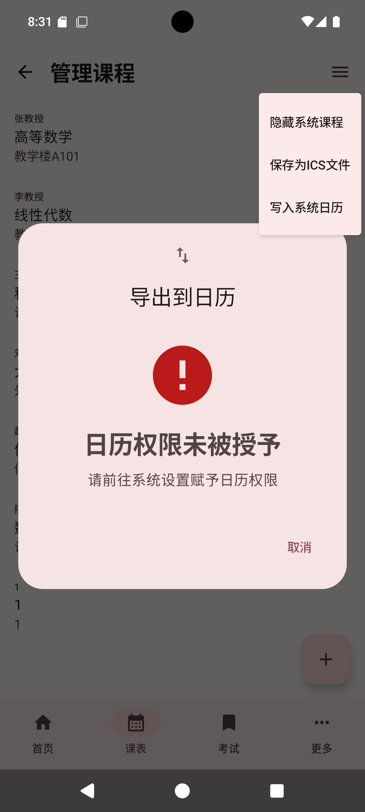

出现这个提示时，请前往手机系统设置，找到本应用，并打开日历权限。打开权限后，再回到应用重新尝试写入系统日历。

## 常见情况

课程列表为空：请先确认已经登录并刷新过课表；如果隐藏了系统课程，可以重新进入页面查看是否只剩自定义课程。

找不到编辑或删除按钮：在课程列表中左右滑动课程项，按钮会从侧边出现。

写入日历失败：请检查是否已经允许应用访问日历。

导出的文件打不开：可以换一个支持日历文件的应用打开，或改用“写入系统日历”。
