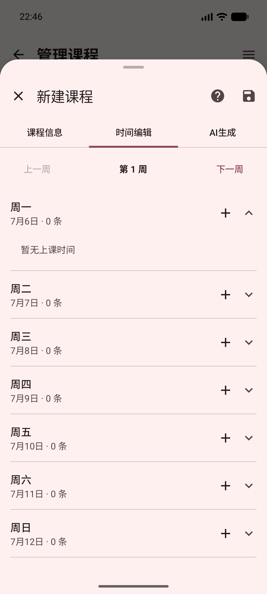
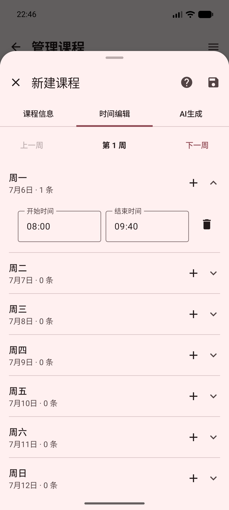
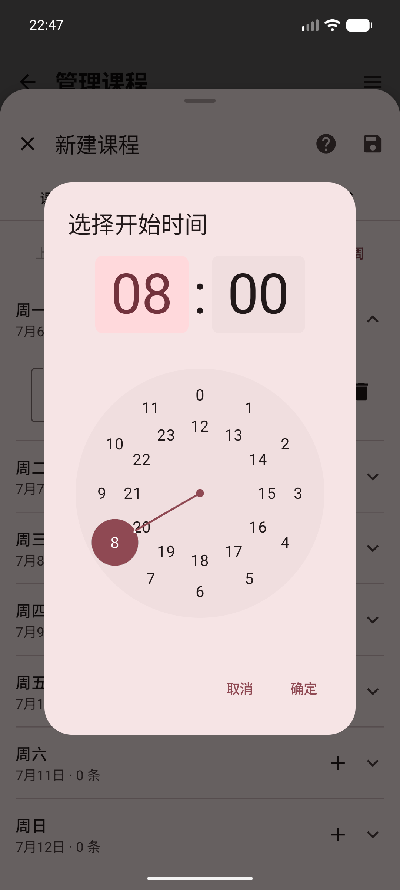

# 课程管理

“课程管理”页面用于整理自己的课程。你可以查看课程列表、隐藏系统课程、添加临时课程、修改自定义课程，也可以把课表保存成文件或写入手机日历。

从[课表页面](./course-timetable.md)点击“管理课表”，即可进入这里。

## 查看课程列表

课程列表通常会显示：

- 教师姓名
- 课程名称
- 教室名称

课程较多时，上下滑动页面即可查看其他课程。点击左上角的返回按钮，可以回到课表页面。

::: tip

系统课程来自学校课表；自定义课程是你自己添加的课程。两类课程都会显示在列表中，但操作权限不同。

:::

## 使用右上角菜单

点击右上角的菜单按钮，可以看到以下功能：

- 隐藏或显示系统课程
- 保存为 ICS 文件
- 写入系统日历

菜单只有在课程数据准备好后才能使用。如果页面正在加载或同步失败，请稍后再试。

### 隐藏或显示系统课程

选择“隐藏系统课程”后，列表只显示你自己添加的课程。

隐藏后，菜单中的选项会变成“显示系统课程”。再次点击即可恢复系统课程。

::: warning

隐藏系统课程只是改变当前列表的显示内容，不会删除学校课表，也不会删除课程数据。

:::

如果列表变成空白，先打开右上角菜单，选择“显示系统课程”。

## 新建课程

点击右下角的“添加课程”或“+”按钮，可以添加一门自己的课程。

::: tip

自定义课程适合记录临时课程、社团活动或学校课表中没有同步到的安排。

:::

### 填写课程信息

在“课程信息”页填写：

- 课程名称
- 教师姓名
- 教室名称
- 学分
- 是否为学位课

教师姓名、学分和“学位课”可以按实际情况填写。课程名称、教室名称和至少一条上课时间是保存课程所必需的。

填写完成后，点击右上角的保存图标。暂时不想保存时，点击左上角的关闭图标。

编辑页面右上角的问号按钮可以重新打开本页帮助。顶部的“课程信息”“时间编辑”和“AI生成”可以点击切换，也可以左右滑动切换。

::: warning

保存前请确认课程名称、教室名称和上课时间都已填写。课程时间不能重叠，结束时间也必须晚于开始时间。

:::

### 设置上课时间

点击“时间编辑”页，可以为课程添加每周的上课安排。

操作方法：

1. 点击“上一周”或“下一周”，切换要编辑的周次。
2. 点击某个星期的课程行，展开当天的安排。

3. 点击右侧的“+”，添加一条上课时间。

4. 点击“开始时间”或“结束时间”，在时间选择器中修改时间。

5. 点击删除图标，移除不需要的上课时间。
6. 再次点击星期行，可以收起当天的安排。

每个星期的下方会显示日期和已添加的时间条数，方便确认安排是否完整。

::: warning

如果同一周同一天的时间互相重叠，或者结束时间早于开始时间，页面会显示错误提示，课程无法保存。请先修改时间。

:::

### 使用 AI 生成课程

点击“AI生成”页，可以让应用根据文字或课程表图片填写课程信息。

使用步骤：

1. 在“AI模型”中选择一个已经配置好的模型。
2. 在输入框中填写课程名称、教师、教室、周次、星期和上课时间等信息。
3. 点击“生成”，等待结果出现。
4. 也可以点击“选择图片”，选择一张课程表图片。
5. 检查课程信息和每一条上课时间。
6. 确认无误后，点击右上角保存。

如果没有配置 AI 模型，页面会提示你前往[设置中的 AI 模型配置](./settings.md#ai模型配置)。如果所选模型不支持图片输入，“选择图片”可能无法使用。

::: warning

AI 生成的内容只是填写建议，可能会读错课程名称、周次、节次或教室。保存前必须逐项检查；如果只生成了部分内容，也要手动补全。

:::

::: tip

图片越清晰、文字越完整，生成结果通常越容易检查。无法识别时，可以改用文字输入。

:::

## 编辑自定义课程

只有自己添加的课程可以编辑。

在手机上，向一侧滑动课程，可以显示编辑操作；在较大屏幕上，课程旁会直接显示编辑按钮。点击编辑按钮后，会打开课程编辑页面。

课程编辑页面与新建课程页面相同，可以修改课程信息、上课时间和 AI 生成结果。修改完成后点击右上角保存。

::: warning

学校同步来的系统课程不能修改。如果找不到编辑按钮，通常是因为这是一门系统课程。

:::

## 删除自定义课程

只有自己添加的课程可以删除。

在手机上，向另一侧滑动课程，可以显示删除操作；在较大屏幕上，点击课程旁的删除按钮。

::: danger

删除后，这门自定义课程会从课程列表中移除，页面没有撤销按钮。请确认不再需要后再删除。

:::

系统课程不能删除。若只是暂时不想看到系统课程，请使用“隐藏系统课程”。

## 保存为 ICS 文件

ICS 是一种可以被日历软件读取的课程文件。

操作步骤：

1. 点击右上角菜单。
2. 选择“保存为ICS文件”。
3. 等待应用准备课程文件。
4. 在系统文件保存页面选择保存位置，并确认文件名。
5. 点击“保存”。

保存完成后，应用会返回课程管理页面，并显示“导出成功”。

::: tip

导出的文件可以发送给其他日历软件或设备。打开文件时，请选择支持 ICS 文件的日历应用。

:::

::: warning

如果在系统文件保存页面点击取消，文件不会保存。需要再次导出时，重新执行上述步骤即可。

:::

## 写入系统日历

这个功能会把课程安排加入手机自带的日历。

操作步骤：

1. 点击右上角菜单。
2. 选择“写入系统日历”。
3. 第一次使用时，按系统提示允许应用访问日历。
4. 等待页面完成准备、解析和写入。
5. 返回课程管理页面后，看到“导出成功”即表示完成。

::: warning

再次写入时，应用会更新它之前写入的课程日程。若你手动修改过这些课程，重新写入后可能会被最新课表内容覆盖。

:::

如果没有允许日历权限，请前往手机系统设置，找到本应用并打开日历权限，然后重新尝试。

如果当前设备不支持日历功能，页面会提示无法使用。此时可以改用“保存为ICS文件”。

::: tip

写入日历前，建议先到[同步设置](./settings.md#立即同步)更新一次课表，避免把旧课程写入手机日历。

:::

## 遇到问题怎么办

### 课程列表为空

先确认已经登录并完成课表同步。若之前隐藏了系统课程，请在菜单中选择“显示系统课程”。

### 页面显示同步失败

检查网络和登录状态，然后到[同步设置](./settings.md#立即同步)重新同步。同步完成后再打开课程管理。

### 无法保存课程

检查课程名称、教室名称和上课时间是否填写；再确认时间没有重叠，且结束时间晚于开始时间。

### 找不到编辑或删除按钮

确认课程是自己添加的。手机上左右滑动课程，较大屏幕上直接查看课程旁的编辑或删除按钮。

### AI 没有生成正确内容

检查 AI 模型是否已配置，输入文字或图片是否清晰。生成后请手动修正，不要直接相信结果。

### 日历写入失败

检查日历权限是否开启。如果设备不支持日历写入，可以导出 ICS 文件后使用其他日历应用打开。
