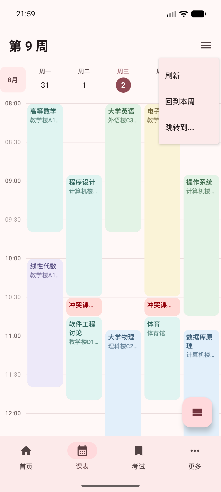
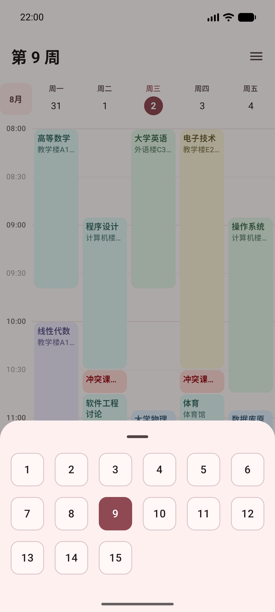
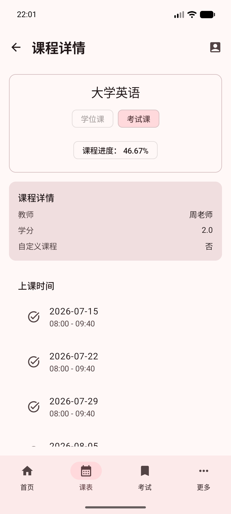
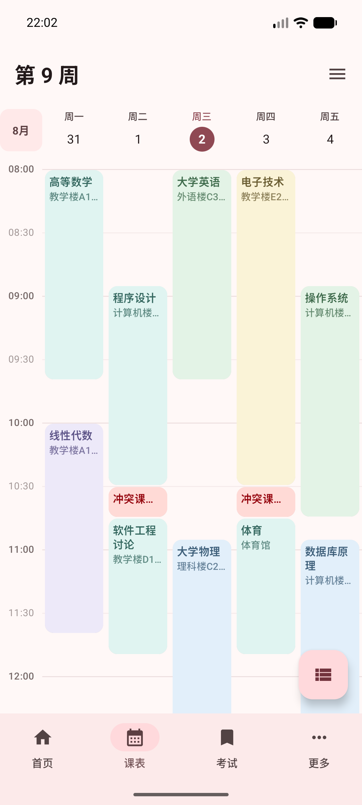
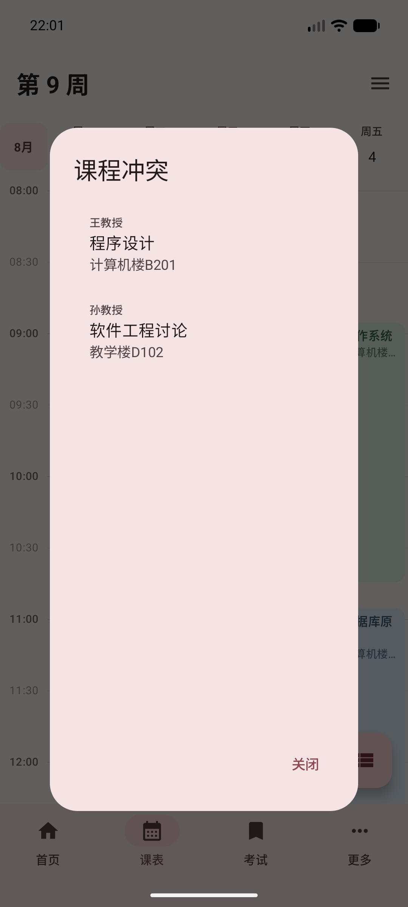

# 课表页面

“课表”页面用于查看当前学期每一周的课程安排。你可以切换周次、查看课程详情、处理时间冲突，也可以进入“课程管理”整理自己的课程。

## 查看一周课程

进入底部的“课表”页面后，页面顶部会显示当前周次，例如“第 9 周”。

课表中会显示：

- 每天的日期和星期
- 每一节课的时间
- 课程名称
- 上课地点

当天的日期会用颜色突出显示。课程会显示为不同颜色的卡片；同一时间有多门课程时，会显示冲突课程提示。

操作方法：

- 左右滑动课表，切换到上一周或下一周。
- 上下滑动课表，查看完整的一周。
- 在手机上用双指捏合，放大或缩小时间表，方便查看密集的课程安排。

::: tip

如果周末没有课程，并且设置中开启了“隐藏周末课程”，课表会自动隐藏周六和周日。需要查看完整一周时，可以到[外观设置](./settings.md#隐藏周末课程)关闭这个选项。

:::

## 使用课表菜单

点击右上角的菜单按钮，可以打开课表菜单。

菜单中包括：

- “刷新”：重新加载当前已同步的课表显示。
- “回到本周”：回到今天所在的教学周。
- “跳转到...” ：直接选择要查看的周次。

如果需要从学校系统获取最新课表，请到[同步设置](./settings.md#立即同步)使用“立即同步”；课表页面的“刷新”主要用于重新加载当前数据。

## 切换到其他周

有两种方式可以切换周次：

### 左右滑动

在课表区域左右滑动，可以逐周查看课程。

### 通过菜单选择

1. 点击右上角菜单。
2. 选择“跳转到...”。
3. 在周次列表中点击目标周次。

当前所在周次会用醒目的颜色标记。选择后，页面会自动切换到对应周次。

::: tip

查看其他周后，可以使用“回到本周”快速返回今天所在的教学周。如果已经在本周，再次点击会提示“当前周数无需跳转”。

:::

## 查看课程详情

点击普通课程卡片，可以打开“课程详情”页面。

课程详情页通常会显示：

- 课程名称
- 学位课或考试课标记
- 课程进度
- 教师姓名
- 学分
- 是否为自定义课程
- 每一次上课的日期和时间

点击左上角返回按钮，可以回到课表。

::: tip

有时间冲突的普通课程，第一次点击可能会先展开冲突提示；再次点击课程卡片即可进入课程详情。

:::

## 查看冲突课程

如果同一时间有多门课程，课表上会显示“冲突课程”卡片。

点击冲突课程卡片，会打开“课程冲突”窗口。

窗口中会列出发生冲突的课程，并显示教师和教室。点击其中一门课程，可以继续查看它的详细信息；点击“关闭”可以回到课表。

::: warning

应用只能提醒时间重叠，不能判断哪一门课最终需要参加。遇到冲突时，请以学校教务系统、学院通知或教师通知为准。

:::

## 进入课程管理

点击课表页面右下角的“管理课表”按钮，可以进入[课程管理](./course-overview.md)。

在那里可以添加自定义课程、修改或删除自定义课程、隐藏系统课程，以及导出课程安排。

## 特殊情况

### 正在加载课表

页面显示“正在同步课表，请稍等”或“正在加载课表，请稍等”时，请等待同步完成，不要连续点击菜单。

### 课表同步失败

页面显示“同步失败”或“加载课表失败”时，先检查网络和登录状态，再到[同步设置](./settings.md#立即同步)重新同步。

### 学期还没有开始

开学前可以浏览已经同步到手机的学期安排，但“回到本周”可能不会显示，因为当前还没有对应的教学周。

### 学期已经结束

学期结束后，页面可能显示“享受假期吧！”的提示。需要查看旧课程时，可以在课程管理或历史数据中确认是否已经同步保存。

## 常见问题

### 看不到课程

确认当前周次是否正确，再尝试左右切换周次。如果所有周次都没有课程，请检查登录状态并重新同步。

### 看不到周末课程

检查[外观设置](./settings.md#隐藏周末课程)中的“隐藏周末课程”是否开启。关闭后会显示完整的一周。

### 课程时间或地点不正确

先重新同步课表。如果仍然不正确，请以学校教务系统和教师通知为准。

### “回到本周”没有切换

如果已经在今天所在的教学周，应用会提示“当前周数无需跳转”，这是正常现象。
