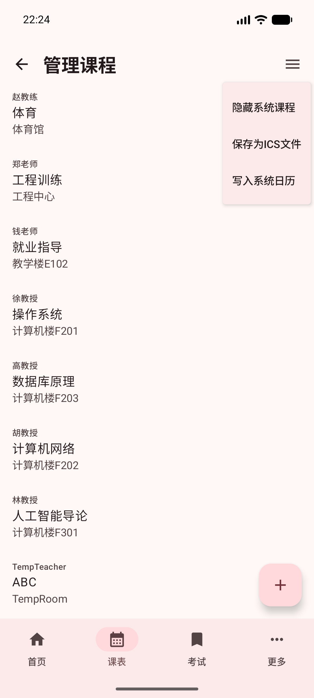

# 课表页面

课表页面用于查看一周内每天的课程安排。你可以在这里确认上课时间、课程名称、上课地点，也可以切换到其他周查看课程。

## 查看课表

进入底部“课表”页面后，会看到当前周的课程安排。

页面顶部显示当前是第几周。下面一行显示日期和星期，粉色高亮的一列表示当天。左侧显示第几节课和对应时间，中间的彩色方块就是课程。

每个课程方块里通常会显示：

- 课程名称
- 上课地点

如果某一天没有课程，对应位置会留空。

::: tip
课表显示效果可以通过[外观设置](./settings.md#外观设置)调整，例如用“隐藏周末课程”精简视图，或用“显示实验课提示”控制概要页的实验课提醒。
:::

## 打开课表菜单

点击右上角的菜单按钮，可以打开课表菜单。

菜单里有三个常用操作：

- “刷新”：重新获取课表。
- “回到本周”：快速回到当前这一周。
- “跳转到...”：选择要查看的周次。

## 切换周次

如果想查看其他周，可以点击菜单里的“跳转到...”，然后选择对应周次。

选择后，课表会切换到那一周。比如选择“第 1 周”，页面就会显示第 1 周的课程。

## 刷新课表

如果你刚登录、刚改过选课，或者觉得课表内容没有更新，可以点击右上角菜单，再选择“刷新”。

刷新后，请稍等片刻，页面会重新显示最新的课表内容。

::: tip
如果不想每次手动刷新，可以通过[同步设置](./settings.md#同步设置)里的“同步时长”控制自动同步；需要马上更新时，也可以使用“立即同步”。
:::

## 回到本周

当你查看了其他周后，可以通过菜单里的“回到本周”快速回到当前周。

如果你本来就在当前周，页面会提示“当前周数无需跳转”。这表示已经在本周课表，不需要再切换。

## 查看课程详情

点击任意课程方块，可以进入课程详情页面。

课程详情页会显示这门课的更多信息，例如：

- 课程名称
- 任课教师
- 学分
- 课程类型
- 已完成进度
- 具体上课日期和时间

如果想回到课表，点击左上角返回按钮即可。

## 查看冲突课程

如果同一时间有多门课程，课表上会显示“冲突课程”，并提示“点击查看”。

点击这个方块后，会弹出冲突课程窗口。

窗口中会列出冲突课程的信息，例如课程名、教师和上课地点。查看完后，点击“关闭”回到课表。

遇到冲突课程时，建议以学校教务网或任课教师通知为准，确认当天实际需要去上的课程。

## 常见情况

课表为空：请先确认已经用自己的教务网账号登录；如果仍然为空，可以尝试刷新。

看不到某一天的课程：可以左右滑动课表区域，确认是否被屏幕宽度挡住。

切换周次后找不到本周：点击右上角菜单，选择“回到本周”。

课程时间或地点看起来不对：先刷新课表；如果仍有疑问，以学校教务网和老师通知为准。
