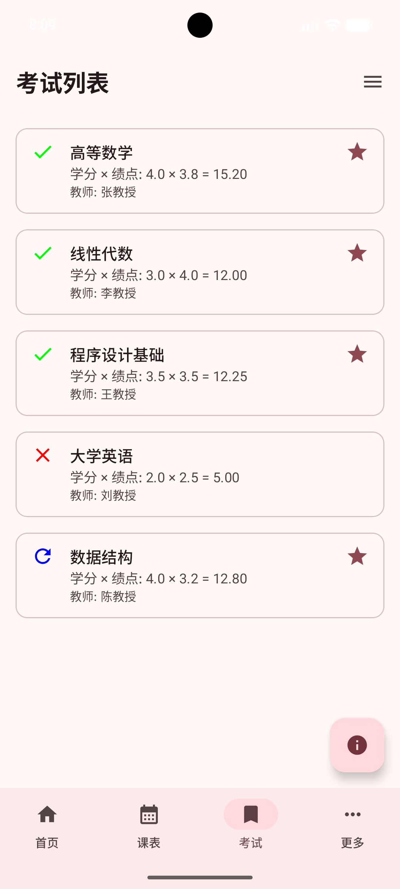
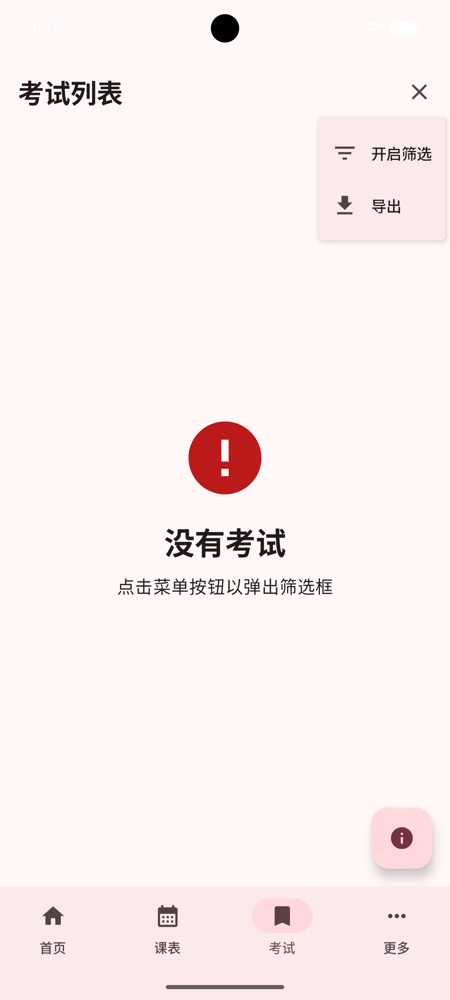
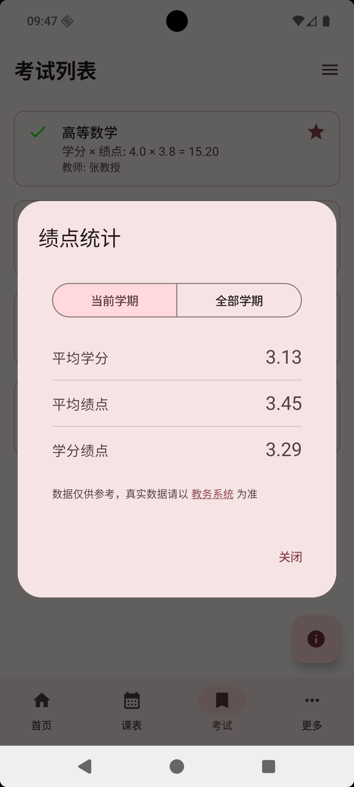
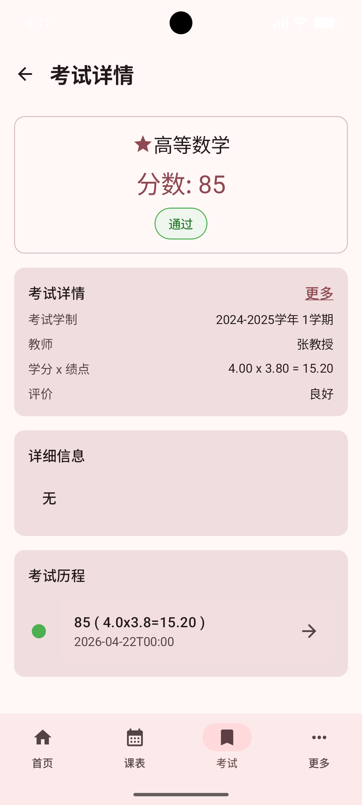
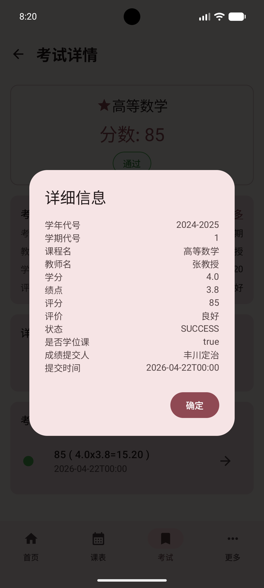
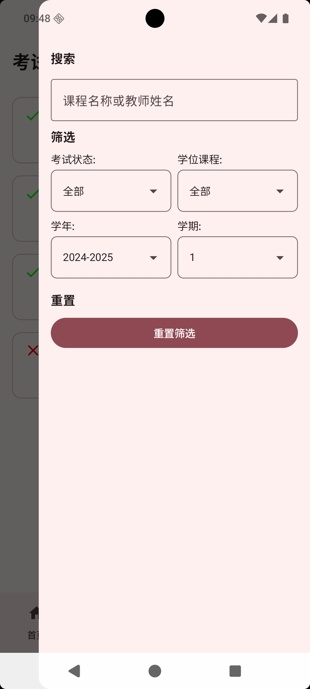
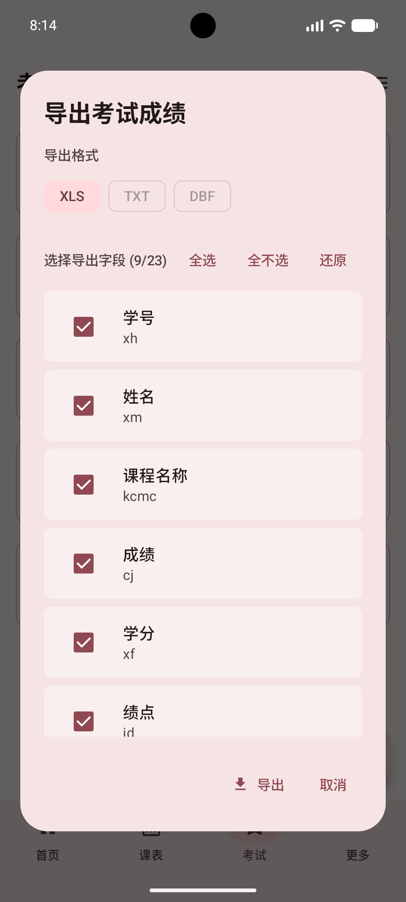

# 考试

考试页面用于查看历史考试成绩考试详情，应用会同步教务系统中的考试数据，并保存到本地。

## 考试概要

进入“考试”页面后，你会先看到按卡片排列的考试列表。

每张卡片通常会展示：

- 课程名称
- 教师姓名
- 学分与绩点的对应关系
- 当前考试结果
- 是否为学位课

不同结果会用更直观的方式区分：

- 通过：会显示通过标记
- 挂科：会显示挂科标记
- 补考或重修后通过：会显示单独的补考/重修通过标记

如果是学位课，卡片上还会额外显示星标，方便你快速辨认重点课程。

点击任意一项考试后，可以进入详情页继续查看。

如果当前学期或当前筛选条件下没有可显示的考试，页面会提示“没有考试”。

这时通常有两种情况：

- 还没有同步到考试数据
- 当前筛选条件过严，把结果筛空了

你可以先打开筛选面板，恢复为“全部”后再看一次。

::: tip
如果考试列表为空，可以先通过[立即同步](./settings.md#立即同步)重新获取数据；也可以配置“同步时长”，让考试、成绩等数据定期更新。
:::

页面右上角还有一个菜单，常用操作也集中在这里。

菜单里主要有两个入口：

- 打开或关闭筛选面板
- 导出当前范围内的考试成绩

页面右下角的浮动按钮是“绩点统计”，可以快速查看当前筛选范围对应的统计结果。

## 考试详情

点击某一门考试后，会进入“考试详情”页面。

详情页会把一门课的考试信息拆成几个区域展示，便于你快速看重点。

第一眼通常能看到的是分数卡片，这里会集中显示：

- 课程名称
- 分数
- 当前结果状态
- 是否为学位课

下方的“考试详情”区域会继续补充：

- 所属学年与学期
- 任课教师
- 学分 × 绩点
- 成绩评价

如果你想看更完整的信息，可以点“更多”。

弹出的详细信息窗口里，通常还能看到：

- 学年代号、学期代号
- 课程名、教师名
- 学分、绩点
- 分数、评价
- 当前状态
- 是否学位课
- 成绩提交人
- 提交时间

页面中还会有一块“详细信息”列表，用来展示这门考试更细的附加内容。不同课程、不同成绩来源下，这部分信息可能会略有差异。

## 筛选功能

如果考试很多，可以使用筛选功能快速缩小范围。

筛选面板里支持几类常用条件：

### 关键词搜索

你可以直接输入关键词，按课程名称或教师姓名查找考试。

适合这些场景：

- 想快速找到某一门课
- 想看某位老师名下的成绩
- 想确认某门课是否已经出分

### 按考试结果筛选

可以在以下几类之间切换：

- 全部
- 通过
- 挂科
- 补考

如果你只想看需要重点关注的课程，直接切到“挂科”或“补考”会更方便。

### 按课程属性筛选

你还可以区分：

- 全部课程
- 学位课
- 非学位课

这对于想单独查看学位课表现时会很有帮助。

### 按学年、学期筛选

页面支持先选学年，再选该学年的具体学期。

你可以：

- 查看某一个学期的全部考试
- 对比不同学期的成绩变化
- 将筛选范围限制到当前学期后再做统计或导出

如果更换了学年，学期选项也会自动跟着切换到对应范围。

### 一键重置

如果已经设置了很多条件，不想一个个改回去，可以直接点击“重置筛选”，恢复到更宽松的默认状态。

## 考试历程追溯

考试详情页里有一个很实用的区域，叫“考试历程”。

它会把同一门课在不同时间出现过的成绩记录串起来，按时间线展示。

你通常能从这里看到：

- 这门课每次记录对应的分数
- 每次记录对应的学分和绩点
- 成绩提交时间
- 当时的结果状态

如果某门课曾经挂科、补考、重修，时间线会特别有帮助，因为你能很直观地看到这门课是怎么一步步变化到当前结果的。

点击时间线中的任意一条记录，还可以继续进入那次记录的详情页查看。

这意味着它不仅是“看看历史”，也适合你用来：

- 核对同一门课是否有新成绩覆盖
- 回看补考前后的分数变化
- 确认最终保留下来的状态

## 挂科补考预览

考试页本身就很适合拿来做“挂科与补考预览”。

最直接的做法，是打开筛选面板后切换结果类型：

- 选择“挂科”，查看当前仍未通过的课程
- 选择“补考”，查看进入补考或重修相关状态的课程

这样一来，你可以很快知道：

- 目前有哪些课程需要重点处理
- 哪些课程已经通过补考或重修恢复正常
- 是否还有学位课处于风险状态

如果你只想看高风险项目，建议把条件组合起来使用，例如：

- 挂科 + 学位课
- 挂科 + 指定学期
- 补考 + 指定课程名关键词

另外，导出功能也很适合做留档。

导出时，你可以自行选择要带出的字段，还可以调整字段顺序、全选、全不选，或者恢复默认配置。确认后，应用会把当前选定范围的考试成绩导出为文件保存到本地。

导出过程中会显示进度状态。

如果你需要把挂科、补考或某学期成绩发给老师、同学，或者只是想自己留底，这个功能会比较实用。

## 常见使用建议

- 想看整体情况：先看考试列表，再点右下角“绩点统计”
- 想找某门课：直接用关键词搜索课程名或教师名
- 想排查风险课程：把结果筛选切到“挂科”
- 想回看补考变化：进入详情页看“考试历程”
- 想长期保存：使用导出功能把当前范围的成绩存下来

::: tip
如果同步或导出时遇到异常，可以通过[进入设置](./settings.md#进入设置)中的“高级”查看“系统日志”；需要反馈问题时，可在“关于系统”里使用“邮件反馈”。
:::

## 常见情况

考试列表为空：先确认已经登录并完成同步；如果之前动过筛选，也可以先重置筛选再看。

明明有成绩却没显示：有可能当前选中了别的学年、学期，或者关键词筛选把结果排除了。

详情里看到多条同课程记录：这通常说明这门课存在历史成绩变化，例如补考、重修或重新提交成绩。

统计结果与学校页面不完全一致：应用内统计更适合日常参考，涉及正式认定时，请以学校教务系统显示为准。
