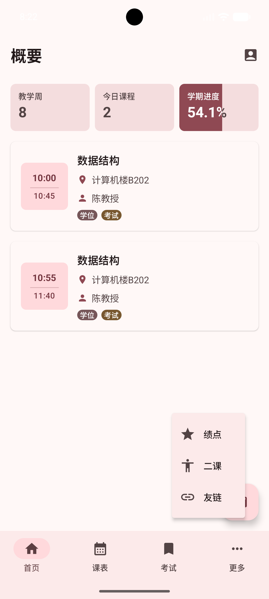
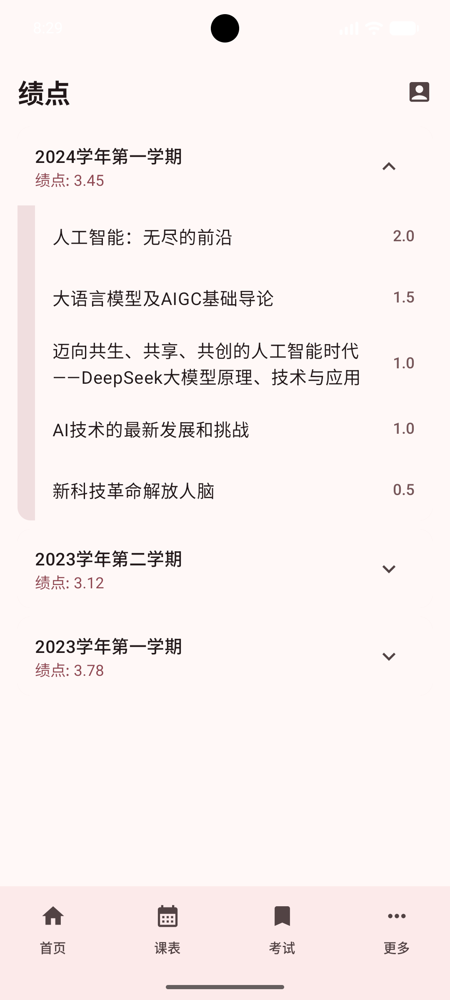

# GPA

GPA 页面用于查看教务系统同步下来的绩点信息。它更像是一张“成绩概览表”：先告诉你每一类统计的总体绩点，再展开查看这类统计下面包含哪些具体项目。

如果你只是想快速了解自己的整体成绩表现，或者想核对某一项绩点统计由哪些成绩组成，可以从这里开始看。

## 进入 GPA 页面

在首页功能入口中找到“绩点”并进入。

进入后，页面会读取已经同步到本地的教务数据。一般情况下，只要登录后完成过数据同步，就可以直接看到绩点内容。

## 成绩数据

GPA 页面不会把所有成绩堆在一起，而是按教务系统返回的统计类别分组展示。

每一组通常会显示：

- 统计名称：例如某一类绩点统计项目
- 该组绩点：这一组对应的绩点结果
- 展开按钮：点击后查看这一组下面的明细

展开某一组后，可以看到这组统计下包含的具体成绩项目。每一行通常会展示：

- 项目名称
- 对应分数或数值

这适合用来核对“这个绩点是由哪些成绩算出来的”。如果你只关心总体表现，可以只看每张卡片上的绩点；如果想看来源，再展开查看明细。

## GPA 统计

页面中的每张卡片就是一项 GPA 统计。卡片上方显示统计名称，下方显示该项绩点。

常见用法：

- 想看总体水平：先看每张卡片上的绩点数字
- 想看统计来源：点击右侧箭头展开明细
- 想收起内容：再次点击箭头即可收起

GPA 页面本身主要负责查看，不需要手动填写或计算。数据来自教务系统同步结果，并保存在本地，方便下次快速打开。

## 没有数据显示时

如果页面没有显示 GPA 内容，通常可能是以下情况：

- 还没有完成教务数据同步
- 教务系统暂时没有返回相关 GPA 数据
- 当前账号没有可展示的对应成绩项目

可以先回到应用中重新同步一次数据，再进入 GPA 页面查看。

## 使用建议

- 需要看单门课程成绩、挂科、补考或重修情况时，建议进入[考试](./exam.md)页面查看。
- 需要看整体绩点结果时，使用 GPA 页面会更直接。
- 如果应用内统计结果和学校页面显示不完全一致，请以学校教务系统的正式结果为准。
