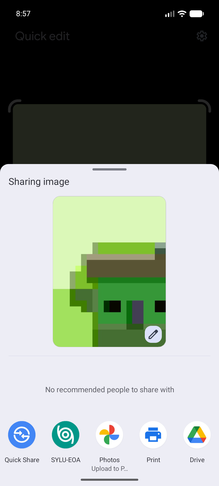
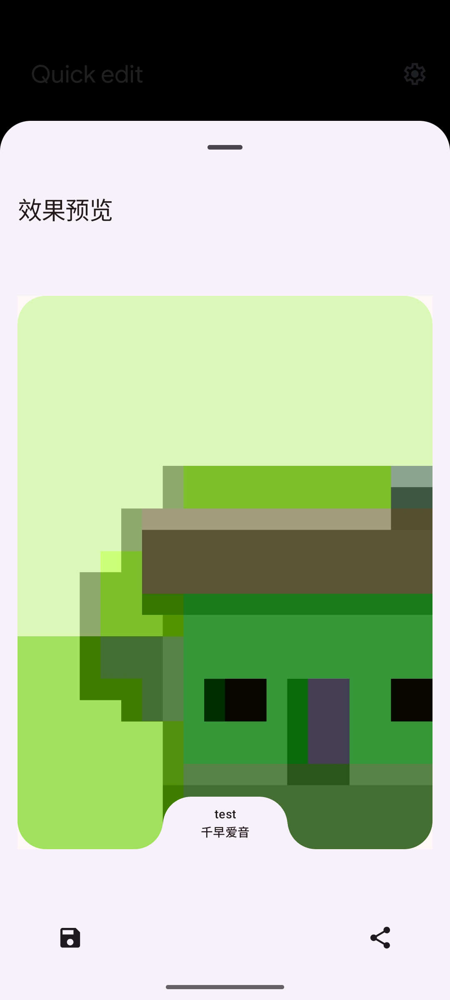
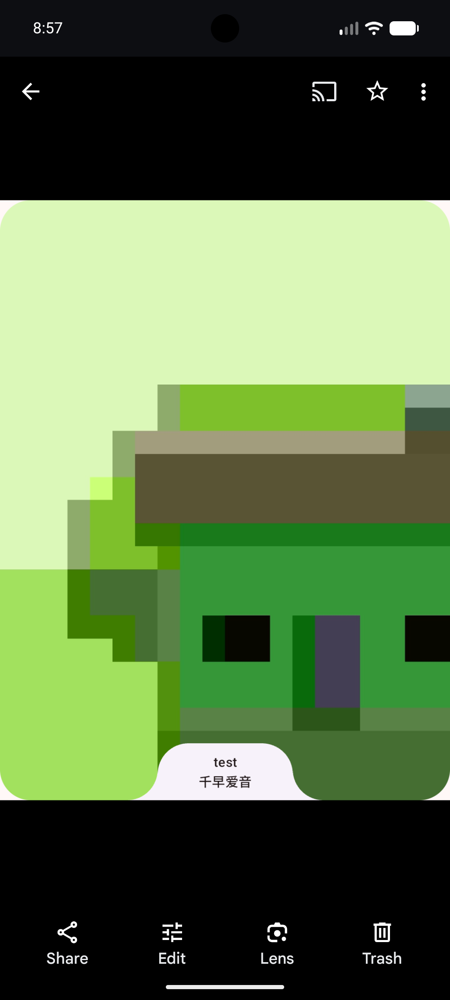

# 图片标记

图片标记用于给截图添加学生信息标识，方便满足学校收集“带签名截图”这类材料时的要求。

你可以从系统中任何支持“分享图片”的场景发起，例如相册、截图预览、聊天软件、文件管理器等。只要系统分享面板里能选到 SYLU-EOA，就可以把图片送进应用处理。处理完成后，也可以把修改后的图片保存到相册，再到其他 App 中选择并上传。

## 外部图片分享

先在其他应用中打开你想处理的图片，然后点击系统的“分享”按钮。

在分享目标中选择 SYLU-EOA。应用会接收这张图片，并打开图片标记预览界面。这个流程不要求你一定从 EOA 内部开始，只要原位置能分享图片，就可以发给 EOA 处理。

::: tip
目前一次主要处理一张图片。如果需要处理多张，请逐张分享。
:::

## 应用内标记

进入应用后，会看到“效果预览”页面。

页面会在原图下方添加一个小标识区域。登录过应用后，这里通常会显示你的学号和姓名，用来表明这张图来自你的 EOA 账号。

如果页面提示“请先登录 SYLU-EOA 然后再进行预览。”，说明应用还没有拿到你的个人信息。此时可以先回到 EOA 完成登录和同步，再重新分享图片。

::: tip
图片标记使用的姓名、学号来自当前登录账号。若信息缺失或不对，可以先通过[个人信息](./settings.md#个人信息)确认资料，再在“同步”中点击“立即同步”。
:::

预览确认无误后，点击底部的保存按钮，应用会把处理后的图片保存到相册。之后你可以像选择普通照片一样，在问卷、班级群、收集表或其他 App 中上传这张处理后的图片。

## 常见情况

分享面板里找不到 SYLU-EOA：请确认分享的是图片内容，而不是网页、文本或其他文件类型。

预览中没有显示姓名：请先打开 EOA 登录并同步个人信息，然后重新分享图片。

保存后找不到图片：请到系统相册或最近保存的图片中查找。
