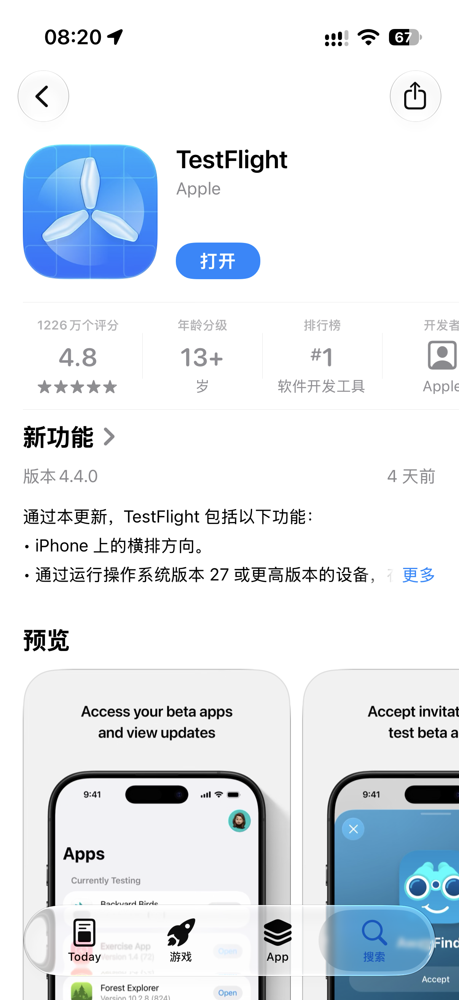
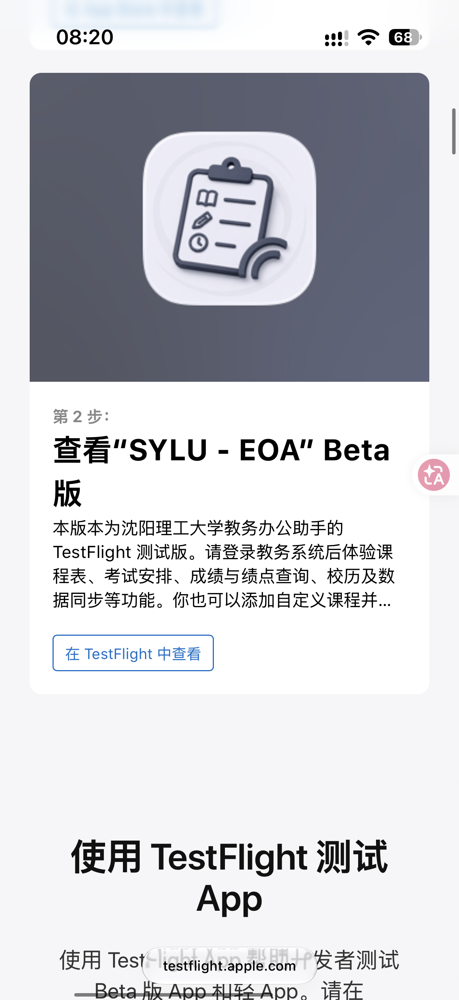
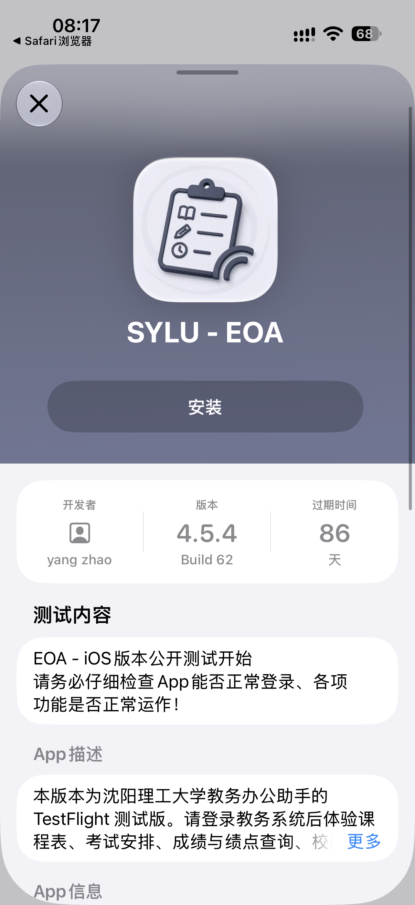

# 安装

EOA 支持 Android 和 iOS。Android 可以直接安装；iPhone 推荐通过 TestFlight 安装。

::: tip 版本支持
本应用支持 Android 6 及以上版本，以及 iOS 16.2 及以上版本。

Android 需要按照自己的系统版本选择安装包；iPhone 可以按照[下面的步骤](#ios)安装。
:::

::: danger 旧系统无法使用
Android 5 及以下、iOS 16.1 及以下无法正常安装或使用本应用。遇到这种情况，只能升级系统或换一台系统版本更高的设备。
:::

## Android

Android 可以直接下载安装包。安装前先确认自己的系统版本，再选择对应的文件。

1. 先看一下手机的 Android 版本。

::: tip 如何查看 Android 版本
一般可以在手机的“设置”里找到：

1. 打开“设置”。
2. 找到“关于手机”或“我的设备”。
3. 查看“Android 版本”。

不同品牌的入口名字可能不完全一样。如果找不到，可以在设置顶部的搜索框里搜索“Android 版本”。
:::

2. Android 9 及以上，下载 [`app-release.apk`](https://gitee.com/kagg886/sylu-educational-office-accesser/releases/download/latest/app-release.apk)。
3. Android 6 到 Android 8，下载 [`app-release-6.apk`](https://gitee.com/kagg886/sylu-educational-office-accesser/releases/download/latest/app-release-6.apk)。
4. 下载完成后，点击这个文件开始安装。

::: warning 安装风险提示
国产手机系统经常会对不是应用商店下载的安装包弹出“有风险”“未知来源”或类似提醒。只要安装包来自本项目的发布页面，就可以选择继续安装。
:::

::: warning 黑边问题
如果打开软件后发现底部有一大块黑边，说明你可能在 Android 6 到 Android 8 的手机上安装了 Android 9 及以上使用的安装包。

遇到这种情况，重新安装 [`app-release-6.apk`](https://gitee.com/kagg886/sylu-educational-office-accesser/releases/download/latest/app-release-6.apk) 这个特供版本即可。
:::

## iOS

安装前可以先确认一下 iPhone 的系统版本。本应用需要 iOS 16.2 或更高版本。

::: tip 如何查看 iOS 版本
打开“设置”，进入“通用”，再进入“关于本机”，查看“iOS 版本”。
:::

### 使用 TestFlight（推荐）

1. 在 iPhone 上打开 [EOA 的 TestFlight 邀请页面](https://testflight.apple.com/join/PpvGHsA6)。
2. 如果还没有 TestFlight，先到 App Store 搜索并安装 **TestFlight**，再回到邀请页面。

   

3. 在邀请页面点击“在 TestFlight 中查看”。

   

4. 打开 TestFlight 后，找到 **SYLU - EOA**，点击“安装”。装好后就可以打开使用了。

   

### 自签安装

如果无法使用 TestFlight，也可以自行安装：

1. 下载 [`ios.ipa`](https://gitee.com/kagg886/sylu-educational-office-accesser/releases/download/latest/ios.ipa)。
2. 打开[安装教程](https://livecontainer.github.io/zh-CN/docs/installation/lc_sidestore#%E6%96%B9%E6%B3%95-2iloader)。
3. 按照教程中的“方法 2：iLoader”，把 `ios.ipa` 安装到 iPhone 上。
