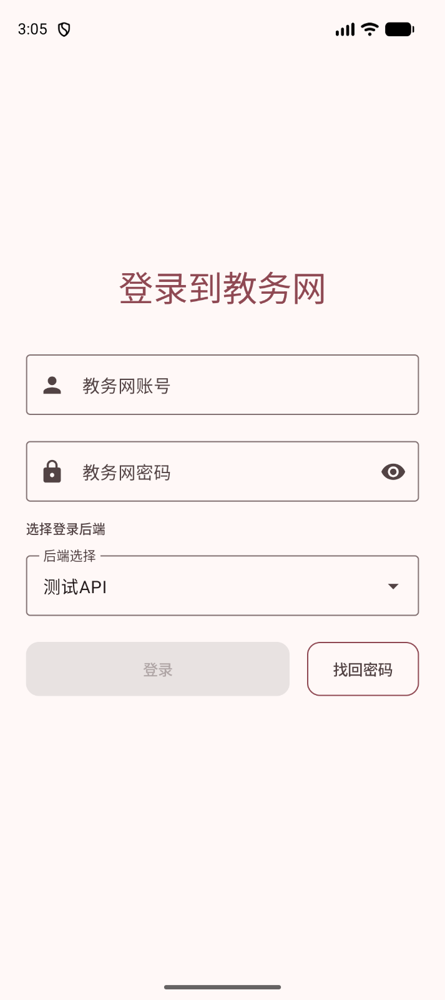
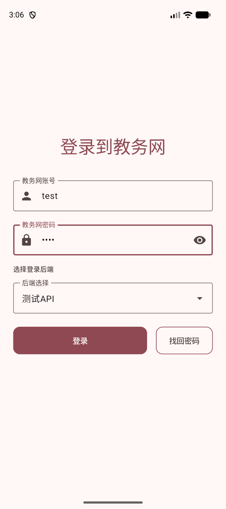
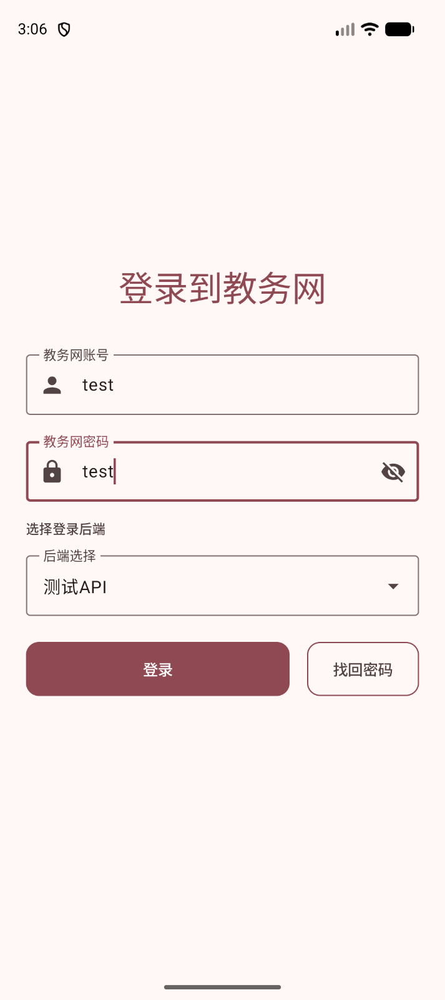
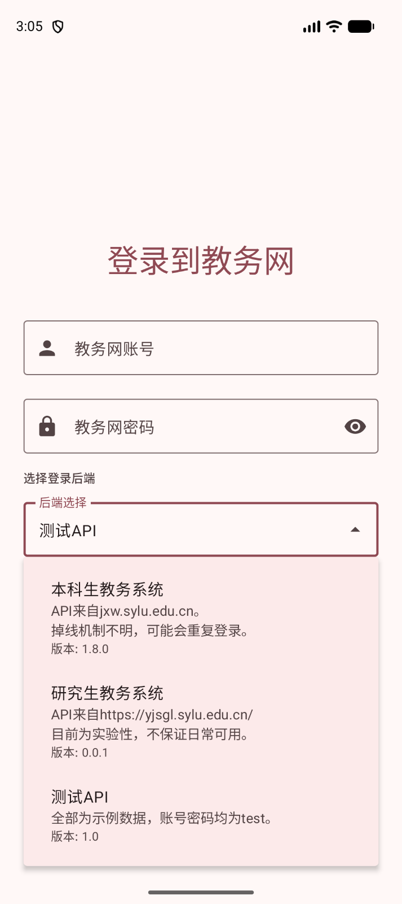

# 登录教务网

第一次打开应用时，你需要使用学校教务网账号登录。应用没有单独的注册入口，直接使用你在教务网页面使用的账号和密码即可。

::: info

这里登录的是学校教务网账号，不是应用账号。应用本身不提供注册和找回应用账号的功能。

:::

## 开始登录

在“登录到教务网”页面按下面的顺序填写：

1. 在“教务网账号”中填写你的教务网账号，通常是学号。
2. 在“教务网密码”中填写教务网密码。
3. 在“后端选择”中选择与你的身份对应的教务系统。
4. 点击“登录”。

登录按钮只有在账号和密码都填写后才会变为可点击状态。密码框右侧的眼睛按钮可以在“显示密码”和“隐藏密码”之间切换，输入较长密码时可以用它检查是否多输或少输了字符。

::: tip

输入密码时，请注意输入法、大小写和前后空格。确认无误后再点击“登录”，可以减少重复验证的次数。

:::

## 选择登录入口

页面上的“选择登录后端”是让你选择要连接的学校系统。点击“后端选择”后，可以看到当前版本提供的入口和说明。

### 本科生教务系统

本科生账号请选择“本科生教务系统”。它连接本科生教务网站，适合查看本科生自己的课表、考试和成绩等信息。

页面中显示的“可能会重复登录”表示学校系统的登录状态可能会变化。遇到同步失败时，重新登录后再同步一次即可。

### 研究生教务系统

研究生账号请选择“研究生教务系统”。这个入口目前仍是实验性功能，能否正常使用会受到研究生教务网站本身和接口变化的影响。

::: warning 研究生系统的功能范围

研究生教务系统目前只提供用户信息、校历、学期和课表等基础内容，暂不提供下面这些功能：

- **考试**：不能查看考试列表、考试详情或导出考试成绩。详见[考试页面说明](./exam.md)。
- **绩点**：不能打开绩点统计页面。详见[成绩与绩点说明](./gpa.md)。
- **第二课堂**：不能使用第二课堂入口。详见[第二课堂说明](./second-class.md)。
- **教务通知**：不能同步和查看教务通知。详见[教务通知说明](./academic-notice.md)。

因此，登录研究生系统后看不到上述入口，属于当前功能范围限制，不是账号登录失败。

:::

::: warning 研究生课表的显示范围

研究生系统提供的课程数据比本科生系统少一些。课表可以正常使用，但课程成绩、课程类型和“学位课”标记等信息可能没有数据。查看课表时，请以[课表页面](./course-timetable.md)和学校教务系统显示的内容为准。

:::

### 测试 API

“测试 API”只用于体验应用界面和示例数据，不连接你的真实教务网信息。它的账号和密码都是 `test`。

::: danger

测试 API 中的课表、成绩和其他内容都是示例数据。不要用它判断自己的真实成绩，也不要因为测试页面显示了内容就认为学校系统已经同步成功。

:::

## 登录时输入验证码

有些情况下，学校系统会要求输入验证码。应用会弹出验证码窗口，显示验证码图片和输入框。

1. 看清图片中的字母或数字。
2. 在“验证码”输入框中照着填写。
3. 点击“确认”继续登录。

验证码为空时，“确认”按钮不能点击。如果验证码看不清，可以点击“取消”，结束这次登录，再重新点击“登录”获取新的验证码。

::: warning

验证码区分大小写时，请按照图片原样填写。点击“取消”不会继续登录，也不会保留这次输入的验证码。

:::

::: danger

验证码和教务网密码都属于登录凭据。不要把验证码图片、密码或登录页面截图发给陌生人。

:::

## 找回教务网密码

如果忘记了教务网密码，可以点击登录页面上的“找回密码”。应用会打开学校教务网提供的密码找回页面。

请按照学校页面的提示完成身份验证和密码修改。修改完成后，回到应用，使用新密码重新登录。

::: warning

找回密码页面属于学校教务网。页面内容和验证方式由学校系统决定；如果页面无法打开，请先检查网络，或直接通过学校教务网尝试找回密码。

:::

## 登录成功后再次打开应用

成功登录后，应用会进入首页。为了下次使用方便，应用会在设备本地保存登录所需的信息；如果之前已经登录过，再次打开应用时可能会直接进入首页。

::: danger

请不要在公共设备、他人的手机或不受信任的模拟器上登录自己的教务网账号。把设备交给别人使用前，请先在应用中退出登录。

:::

如果你想切换账号，可以通过[设置](./settings.md#进入设置)中的“登出”完成。退出后，再返回登录页面选择新的登录入口并填写账号。

## 常见问题

### “登录”按钮是灰色的

确认“教务网账号”和“教务网密码”都已经填写。只填写其中一项时，按钮会保持不可用。

### 提示用户名或密码错误

重新检查账号、密码、大小写和输入法状态。还要确认选择的登录入口与自己的身份一致：本科生使用“本科生教务系统”，研究生使用“研究生教务系统”。

如果确认密码已经忘记，请使用[找回密码](#找回教务网密码)。

### 登录过程中一直没有完成

请先保持网络连接，不要连续点击“登录”。如果等待一段时间后仍然失败，可以重新打开应用再试一次；如果仍有问题，可参考[常见问题与故障反馈](./bug-report.md)。

### 登录失败后如何提供信息

部分错误提示会提供“查看日志”入口。需要反馈问题时，可以先查看日志，再按照[故障反馈说明](./bug-report.md)提供必要信息。

::: details 提交反馈前的检查清单

- 是否选择了正确的登录入口；
- 是否使用了最新的教务网密码；
- 是否完成了验证码；
- 是否在稳定的网络环境下重新尝试过；
- 是否记录了页面提示和发生问题的大致时间。

请不要在反馈中附上真实密码、验证码或完整的个人敏感信息。

:::
