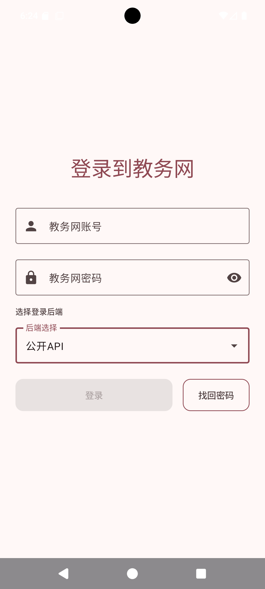
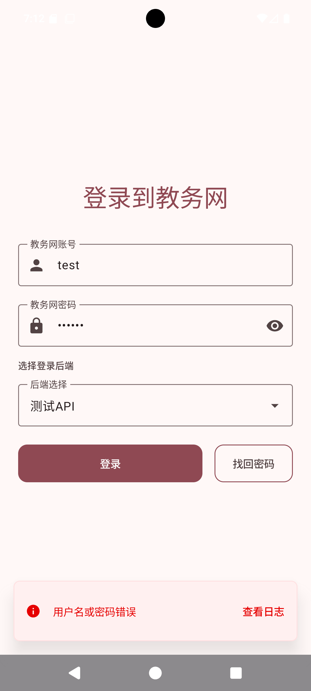
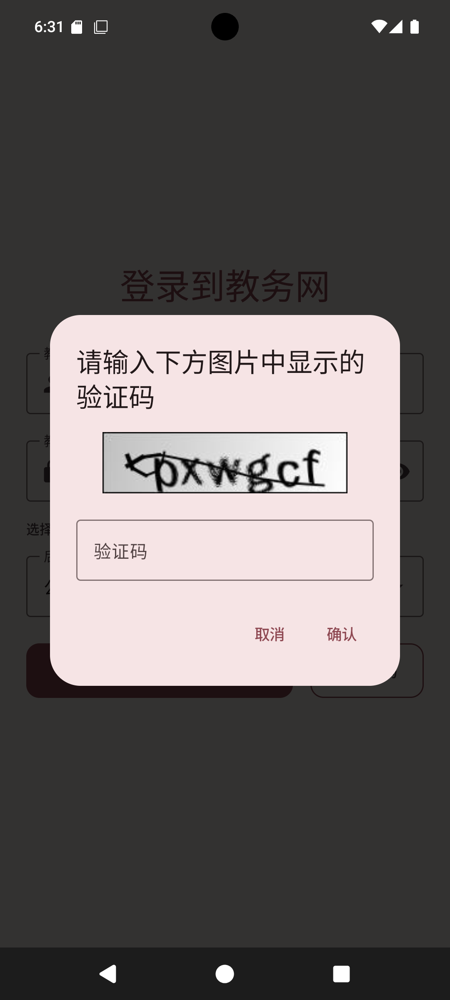
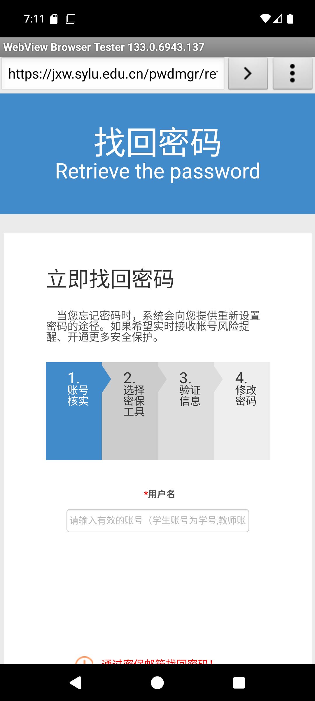
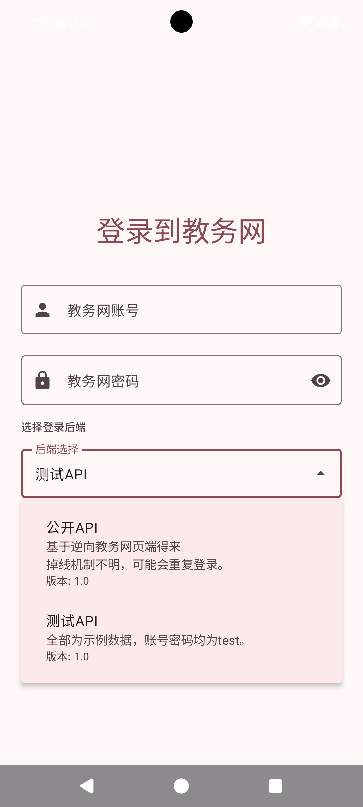

# 登录

本页介绍如何使用教务网账号登录应用，以及遇到验证码、密码错误、忘记密码时该怎么处理。

应用不提供单独注册入口，请直接使用学校教务网账号和密码登录。

## 使用教务网账号登录

打开应用后，会看到“登录到教务网”页面。

1. 在“教务网账号”中输入你的账号。学生通常填写学号。
2. 在“教务网密码”中输入你的密码。
3. 确认“后端选择”已经选好。
4. 点击“登录”。

如果密码框右侧有眼睛图标，可以点一下查看或隐藏密码，方便确认自己有没有输错。

如果页面提示“用户名或密码错误”，请先检查账号和密码是否输入正确，尤其注意大小写、空格和输入法状态。确认无误后仍然无法登录，可以尝试找回密码。

## 输入验证码

有时登录时会弹出验证码窗口，这是学校教务网页面的正常确认步骤。

看到验证码窗口后：

1. 认真看图片中的字母或数字。
2. 在输入框里照着填写。
3. 点击“确认”继续登录。

如果看不清验证码，可以点击“取消”后重新登录，等待出现新的验证码再填写。

## 找回密码

如果忘记教务网密码，请在登录页面点击“找回密码”。

点击后会打开学校教务网的找回密码页面。按照页面提示一步步填写信息即可。一般会经历账号确认、选择找回方式、验证身份、修改密码几个步骤。

修改完成后，回到应用登录页面，使用新密码重新登录。

## 选择登录入口

登录页面中有“后端选择”选项。普通使用时，建议选择“公开API”。

页面中可能会看到两个选项：

- “公开API”：用于正常登录和使用，优先选择它。
- “测试API”：只用于体验示例数据，账号和密码可以填写 `test`。它不代表你的真实教务网信息。

如果你只是想查看应用效果，可以选择“测试API”。如果你要查看自己的课表、成绩、考试等真实信息，请选择“公开API”并使用自己的教务网账号登录。

## 常见情况

登录按钮是灰色的：请检查账号和密码是否都已经填写。

提示账号或密码错误：请重新输入账号和密码，确认没有多输入空格；仍然不行时，使用“找回密码”。

弹出验证码：按图片内容填写验证码，再点击“确认”。

测试账号无法查看真实信息：这是正常的。要查看自己的信息，请切换到“公开API”后登录自己的教务网账号。
