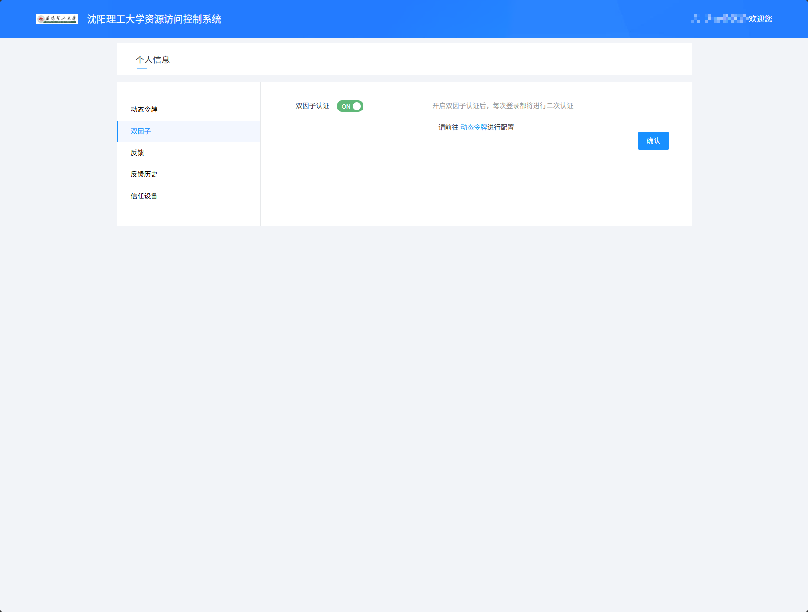
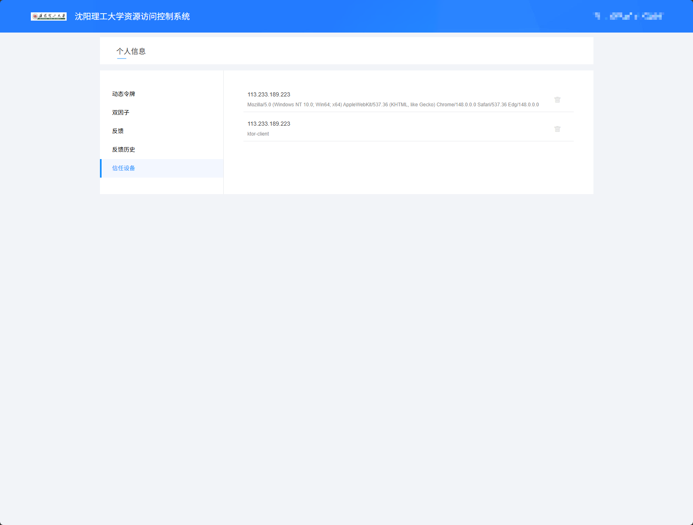
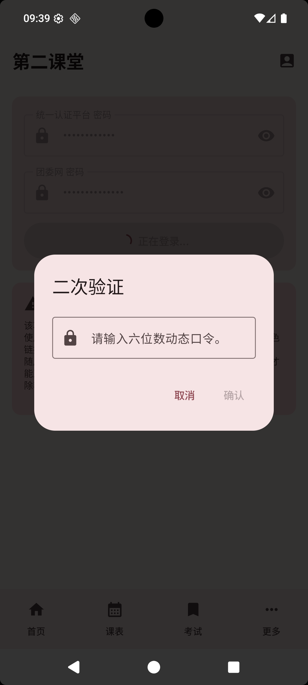

# 第二课堂 (自4.4.3起)

第二课堂页面用于查询团委第二课堂系统中的学分数据。应用会通过校园 VPN 访问二课系统，把已获得的二课项目和分数展示出来，方便你随时查看完成情况。

## 进入第二课堂

在首页功能入口中找到“第二课堂”并进入。

第一次使用时，通常会先看到登录页面。登录成功后，再次进入会优先显示本地保存的数据，并自动尝试刷新。

## 二课登录

第二课堂登录时可能会用到两套密码，请先分清它们分别对应哪里：

- **团委网密码**：登录团委第二课堂系统时使用的密码。应用最终会用它进入二课系统查询学分。
- **统一认证平台密码（可选）**：在校外使用时，应用需要先进入学校 WebVPN。这里要填写的是“智慧理工统一身份认证登录”入口使用的密码。

如果你正在校园网内，通常只需要填写团委网密码。如果你在校园网外，还需要同时填写统一认证平台密码，应用会先帮你登录学校 WebVPN，再进入团委网获取二课数据。

填写完成后点击“登录”。登录过程中按钮会显示“正在登录...”，请等待页面完成处理。

如果不确定“统一认证平台密码”指的是哪个密码，可以打开页面中的“学校 WebVPN 登录页”链接。

这个链接会进入学校 WebVPN 页面。请注意：不要使用页面右侧的“账号登录”来判断密码，也不要把右侧“账号登录”的密码填到应用里。

你需要点击页面中的“智慧理工统一身份认证登录”按钮。进入后能用“智慧理工用户名和密码”登录成功的那套密码，才是应用里“统一认证平台密码（可选）”需要填写的密码。

简单来说：应用里填的 WebVPN 密码，和你在学校 WebVPN 页面点击“智慧理工统一身份认证登录”后填写的密码一致；它不是 WebVPN 页面右侧“账号登录”的密码。

## 滑动验证

登录校园 VPN 时，如果统一认证平台密码输入过多，系统会要求完成滑动验证。

看到“请完成验证”后，拖动滑块到正确位置即可。验证成功后，应用会继续登录并获取二课数据。

如果不想继续，可以点击“取消”。取消后本次登录不会继续完成。

## TOTP

如果你的校园 VPN 开启了二次验证，登录第二课堂时可能会看到验证码页面。

可以先打开校园 VPN 的个人管理页面，查看是否已经开启相关验证。

::: warning
使用此功能完成二次验证后，网页端的设备列表里会多出一条显示为 ktor-client 的记录。请勿删除它，否则应用可能无法继续登录。

:::

在第二课堂的验证码页面中，输入当前验证码后点击确认，即可继续进入。

## 二课概览

登录成功后，页面会按二课类别显示你的完成情况。

顶部每个标签代表一类二课项目，标签中会显示类似“已获得分数 / 要求分数”的进度。未达到要求的类别会用更醒目的颜色提示，方便你优先关注。

页面通常会展示这些类别：

- 思想成长
- 实践实习
- 创新创业
- 志愿公益
- 文体活动

点击顶部标签，可以切换查看不同类别下的项目。

每条项目记录通常会显示：

- 活动或项目名称
- 活动时间
- 获得分数

其中右侧的数字就是该项目计入的二课分数。

## 刷新与退出

登录成功后，右上角会出现菜单按钮。

菜单中有两个常用操作：

- **刷新**：重新从二课系统拉取最新数据
- **退出二课**：清除已保存的二课登录信息和本地二课数据

刷新时，刷新图标会转动，表示正在加载。加载期间菜单操作会暂时不可用。

退出后，页面会回到登录状态。如果之后还想查看二课数据，需要重新填写密码登录。

::: tip
“退出二课”只会清除第二课堂登录信息。如果需要切换整个应用账号，请通过[进入设置](./settings.md#进入设置)使用“登出”；不确定当前账号时，也可以先在“详细信息”中确认。
:::

## 常见情况

登录失败：请先确认统一认证平台密码和团委网密码是否都正确。这两个密码可能不是同一个。

提示无法登录校园 VPN：可能是统一认证平台密码错误、验证码未完成，或校园 VPN 暂时无法访问。

提示无法登录团委网：通常与团委网密码有关，也可能是团委系统临时不可用。

数据没有更新：可以打开右上角菜单，点击“刷新”重新获取。

分数与学校页面不完全一致：应用内数据来自二课系统页面抓取，正式认定请以学校相关系统显示为准。
