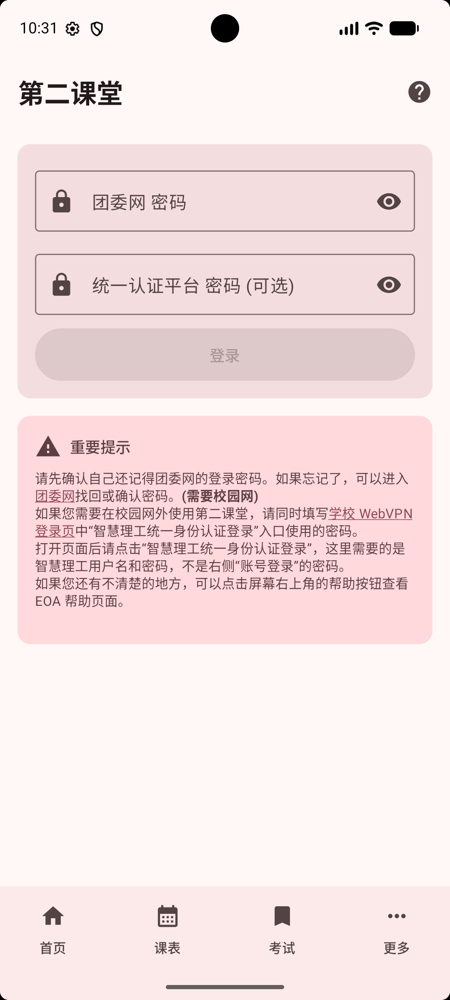
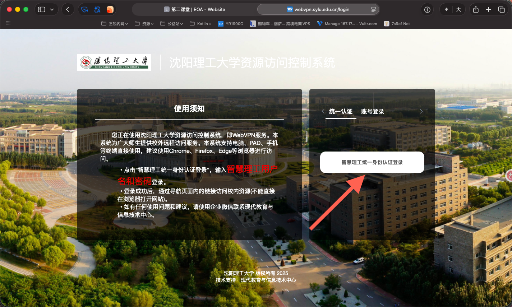
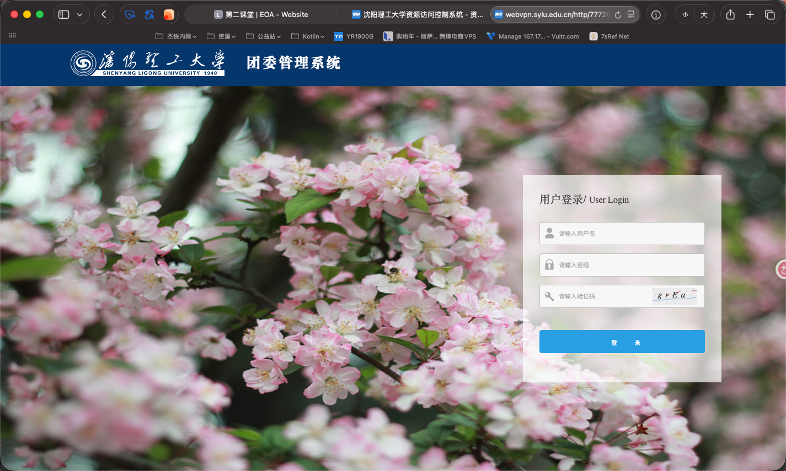
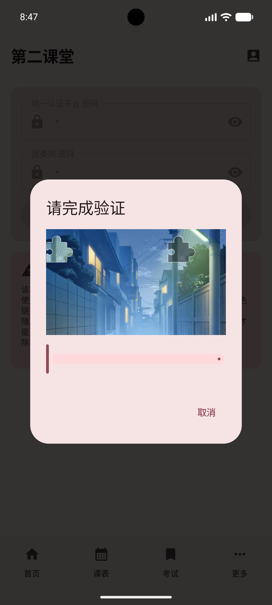
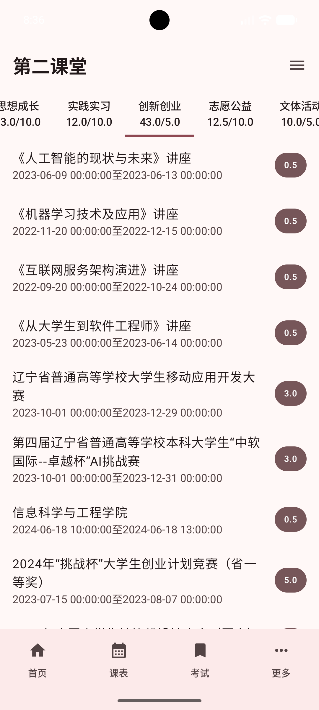
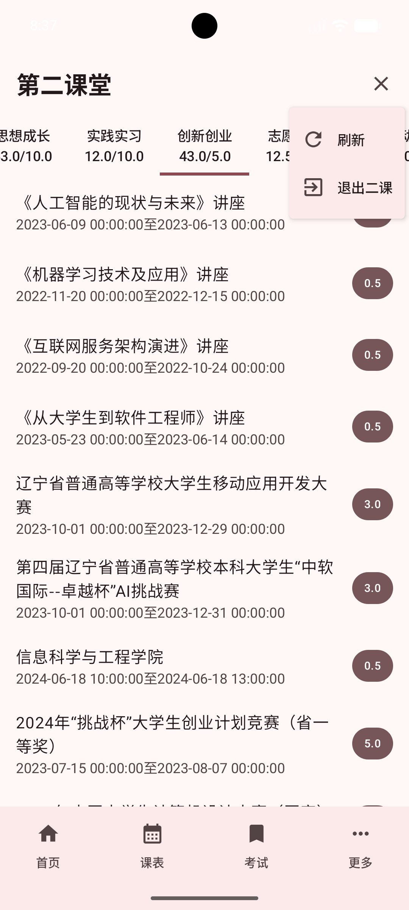

# 第二课堂

第二课堂页面用于查询团委第二课堂系统中的学分数据。应用会通过校园 VPN 访问二课系统，把已获得的二课项目和分数展示出来，方便你随时查看完成情况。

## 进入第二课堂

在首页功能入口中找到“第二课堂”并进入。

第一次使用时，通常会先看到登录页面。登录成功后，再次进入会优先显示本地保存的数据，并自动尝试刷新。

## 二课登录

第二课堂需要填写两个密码：

- **统一认证平台密码**：也就是进入“智慧理工统一身份认证登录”时使用的密码
- **团委网密码**：团委第二课堂系统单独使用的密码

输入两个密码后，点击“登录”。登录过程中按钮会显示“正在登录...”，请等待页面完成处理。

页面下方也会提醒你：该功能会通过校园 VPN 访问二课数据，因此需要先通过统一认证平台，再进入团委网。

如果不确定“统一认证平台密码”指的是哪个密码，可以按下图找到页面中的“校园统一认证平台”链接。

点击后打开的“智慧理工统一身份认证登录”页面，就是统一认证平台密码对应的位置。这里能登录成功的密码，就是上方需要填写的“统一认证平台密码”。

而下方的团委网密码则对应此页面的密码。

## 滑动验证

登录校园 VPN 时，如果统一认证平台密码输入过多，系统会要求完成滑动验证。

看到“请完成验证”后，拖动滑块到正确位置即可。验证成功后，应用会继续登录并获取二课数据。

如果不想继续，可以点击“取消”。取消后本次登录不会继续完成。

## 二课概览

登录成功后，页面会按二课类别显示你的完成情况。

顶部每个标签代表一类二课项目，标签中会显示类似“已获得分数 / 要求分数”的进度。未达到要求的类别会用更醒目的颜色提示，方便你优先关注。

页面通常会展示这些类别：

- 思想成长
- 实践实习
- 创新创业
- 志愿公益
- 文体活动

点击顶部标签，可以切换查看不同类别下的项目。

每条项目记录通常会显示：

- 活动或项目名称
- 活动时间
- 获得分数

其中右侧的数字就是该项目计入的二课分数。

## 刷新与退出

登录成功后，右上角会出现菜单按钮。

菜单中有两个常用操作：

- **刷新**：重新从二课系统拉取最新数据
- **退出二课**：清除已保存的二课登录信息和本地二课数据

刷新时，刷新图标会转动，表示正在加载。加载期间菜单操作会暂时不可用。

退出后，页面会回到登录状态。如果之后还想查看二课数据，需要重新填写密码登录。

::: tip
“退出二课”只会清除第二课堂登录信息。如果需要切换整个应用账号，请通过[进入设置](./settings.md#进入设置)使用“登出”；不确定当前账号时，也可以先在“详细信息”中确认。
:::

## 常见情况

登录失败：请先确认统一认证平台密码和团委网密码是否都正确。这两个密码可能不是同一个。

提示无法登录校园 VPN：可能是统一认证平台密码错误、验证码未完成，或校园 VPN 暂时无法访问。

提示无法登录团委网：通常与团委网密码有关，也可能是团委系统临时不可用。

数据没有更新：可以打开右上角菜单，点击“刷新”重新获取。

分数与学校页面不完全一致：应用内数据来自二课系统页面抓取，正式认定请以学校相关系统显示为准。
