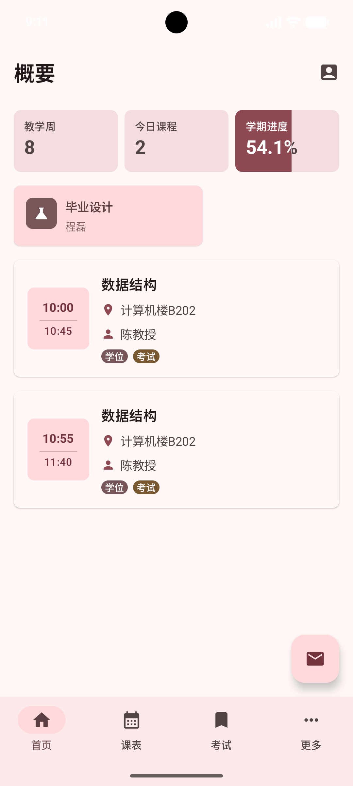
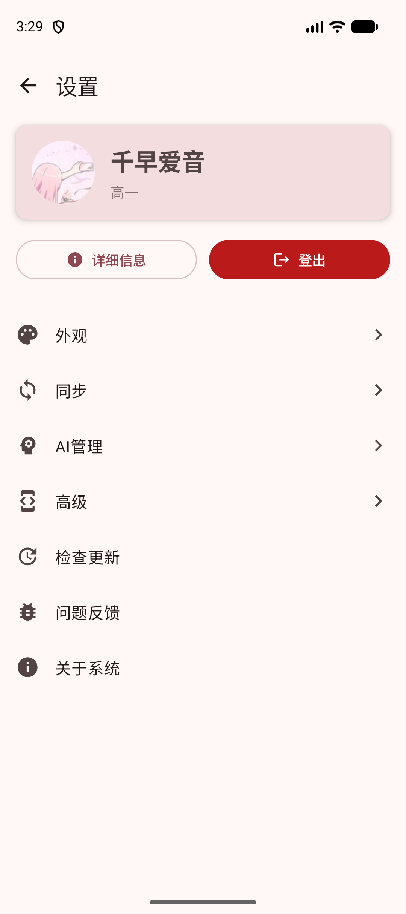
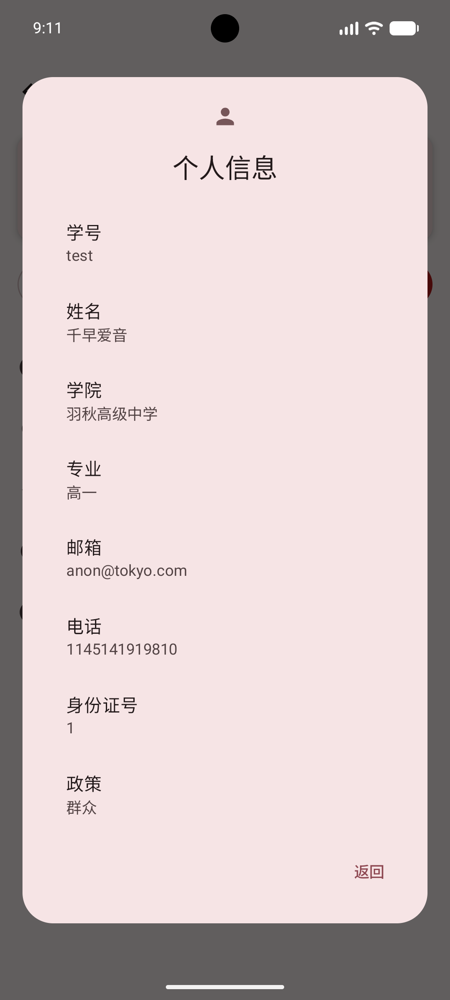
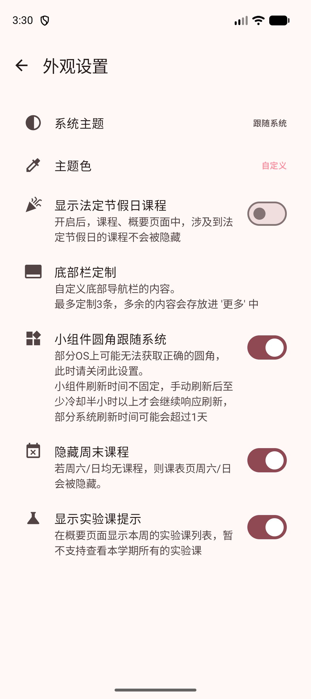
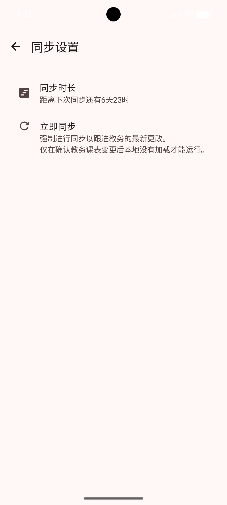
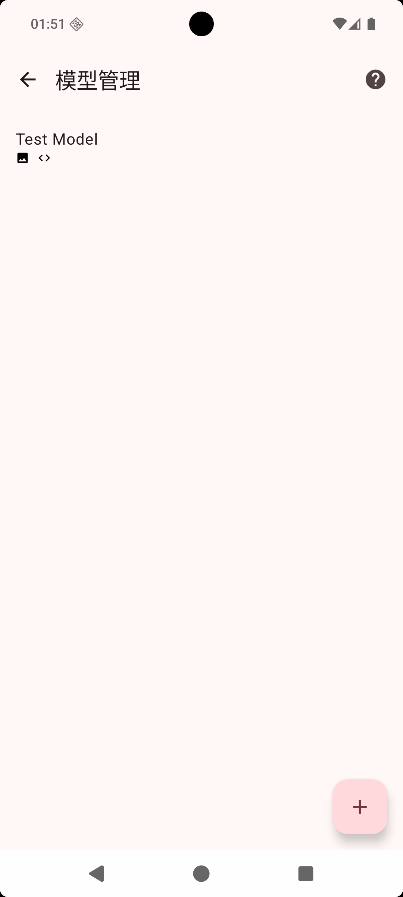
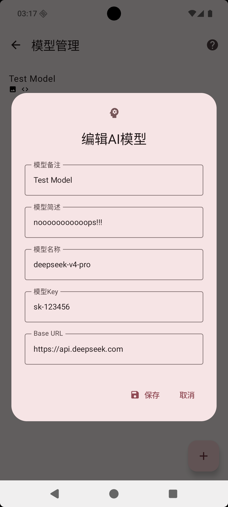

# 设置

设置页面用于查看个人信息、调整外观样式和管理同步行为。

## 进入设置

在 概要 页面点击右上角 头像 icon，即可进入设置页面。

设置页顶部会显示你的头像、姓名和专业信息。下方有两个常用按钮：

- **详细信息**：查看更完整的个人资料
- **登出**：退出当前账号

页面下方还有几个入口：

- **外观**：调整主题、颜色、底部栏、小组件圆角等显示效果
- **同步**：设置自动同步间隔，或手动立即同步
- **高级**：查看系统日志等调试功能
- **检查更新**：检查是否有新版本
- **关于系统**：查看版本、作者、反馈和源代码信息

::: tip
设置页按用途分区：查资料看“详细信息”，换账号用“登出”，改界面进[外观设置](./settings.md#外观设置)，更新数据进[同步设置](./settings.md#同步设置)，排查问题看“高级”和“系统日志”，反馈或看项目可到“关于系统”。
:::

## 个人信息

点击“详细信息”后，可以查看教务系统同步下来的个人资料。

页面中通常会展示：

- 学号
- 姓名
- 学院
- 专业
- 邮箱
- 电话
- 身份证号
- 政策
- 语言

这些信息来自教务系统同步结果。如果内容不完整或没有更新，可以先回到同步设置中手动同步一次。

## 外观设置

进入“外观”后，可以集中调整应用显示效果。

### 系统主题

“系统主题”用于选择应用的明暗模式。

可选项包括：

- **浅色**：始终使用浅色界面
- **深色**：始终使用深色界面
- **跟随系统**：根据手机系统的深色模式自动切换

如果你希望应用和系统保持一致，建议选择“跟随系统”。

### 主题色

“主题色”用于修改应用的主色调。内置颜色包括：姨妈红、闪耀橙、贝斯黄、风祝绿、拉格蓝。

如果内置颜色不合适，也可以选择“自定义”，手动挑选一个喜欢的颜色。

主题色会影响按钮、强调文字、部分图标和小组件等位置的颜色。

### 底部栏定制

“底部栏定制”用于调整底部导航栏显示哪些功能入口。

可选模块包括：首页、课表、考试、绩点、二课、友链。

最多可以定制 3 个底部栏入口，多出来的内容会放进“更多”中。首页是基础入口，不能取消。

### 小组件圆角

::: warning
小组件目前仅 Android 版本支持，因此这个设置只会在 Android 设备上显示。
:::

“小组件圆角跟随系统”会让桌面小组件尽量使用系统提供的圆角样式，使它和手机桌面上的其他小组件更协调。

如果你的手机系统无法正确提供圆角信息，可能会出现圆角看起来不自然的情况。此时可以关闭该选项。

### 隐藏周末课程

开启“隐藏周末课程”后，如果周六和周日都没有课程，课表页会自动隐藏周末列，让页面更紧凑。

如果你周末也有课，或者想始终显示完整一周，可以关闭这个选项。

### 显示实验课提示

“显示实验课提示”用于控制概要页面是否显示本周实验课列表。

开启后，如果本周有实验课，概要页会更方便地提醒你。这个功能目前主要用于查看本周实验课，暂不支持查看整个学期的所有实验课。

## 同步设置

进入“同步”后，可以调整同步周期，也可以手动触发同步。

### 同步时长

“同步时长”表示应用同步成功后，下一次自动同步会间隔多少天。点击后可以在 1 到 30 天之间选择。

修改同步时长后，页面会提示“同步设置将会在重启后生效”。

页面还会显示距离下次同步还有多久。如果已经超过设置时间，应用会在下次启动时同步。

### 立即同步

“立即同步”用于强制重新获取教务系统中的最新数据。适合这些情况：

- 教务课表刚发生变更
- 成绩或考试信息刚更新
- 通知没有及时出现
- 本地数据看起来不是最新

同步正在进行时，按钮会显示“正在同步”，请等待完成。

::: tip
如果只是日常使用，不需要频繁手动同步。确认教务系统数据有变化但应用没有更新时，再通过[立即同步](./settings.md#立即同步)重新获取会更合适。
:::

### 同步异常

如果同步失败，页面会在“立即同步”下方显示失败原因。可以检查网络和登录状态后再试。

## AI模型配置

“AI模型配置”用于管理应用里可以使用的 AI 模型。配置完成后，在需要 AI 辅助的功能中，就可以选择对应模型来生成内容。

如果还没有添加过模型，页面会提示“暂无AI配置”。点击右下角的添加按钮，可以新建一个模型配置。

已经添加的模型会显示在列表中。列表里优先显示“模型备注”，如果没有填写备注，就会显示“模型名称”。每个模型右侧可以进行编辑或删除。

列表中的小图标表示这个模型支持的能力：

- 图片图标：表示可以处理图片内容
- 代码图标：表示更适合返回结构清晰的结果

点击添加或编辑后，会打开模型信息窗口。

这里可以填写：

- **模型备注**：给自己看的名称，例如“日常使用”“识别课表图片”
- **模型简述**：简单说明这个模型适合做什么，方便以后选择
- **模型名称**：模型服务中对应的模型名
- **模型Key**：模型服务提供的访问凭证
- **Base URL**：模型服务地址

填写完成后点击“保存”。保存成功后，这个模型就会出现在模型列表中，也可以在支持 AI 的页面中被选择。

::: tip
如果你不使用 AI 辅助功能，可以不配置这里。模型Key通常由对应的 AI 服务提供，请妥善保管，不要随意分享给他人。
:::

## 常见情况

个人信息不对：先尝试手动同步；如果学校教务系统本身信息未更新，应用内也会保持旧内容。

主题或颜色没有立刻变化：可以返回上一页再进入，或重启应用确认效果。

底部栏找不到某个功能：进入“外观”里的“底部栏定制”，检查是否把该模块取消了。

同步按钮不可点：通常是正在同步或应用还在初始化，稍等片刻即可。
