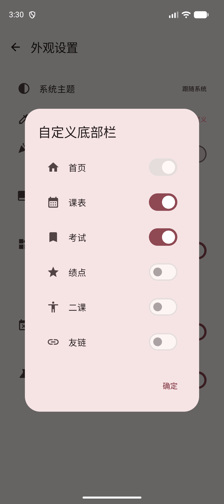
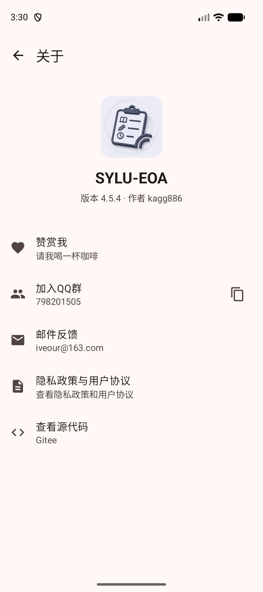
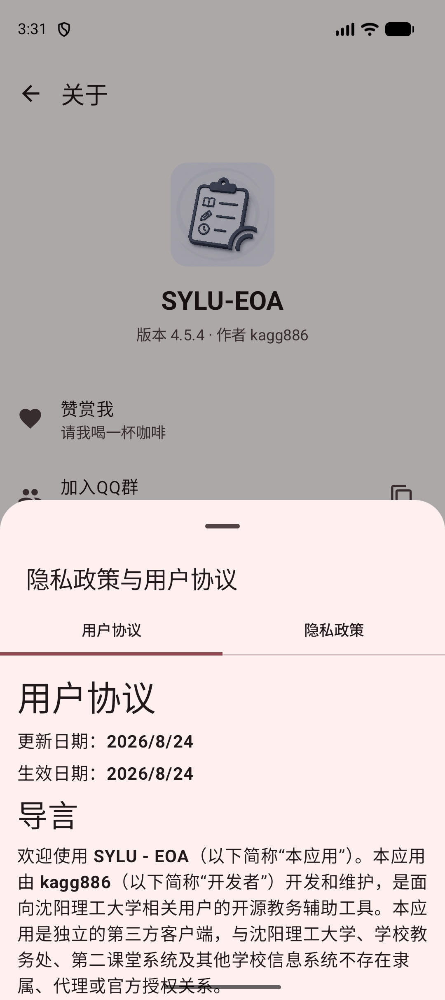
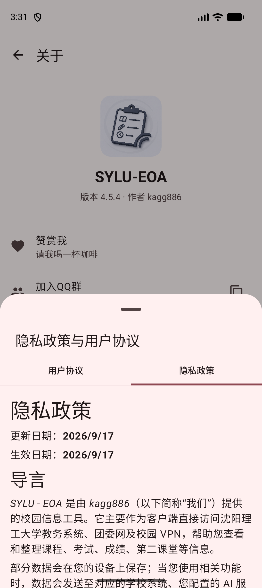
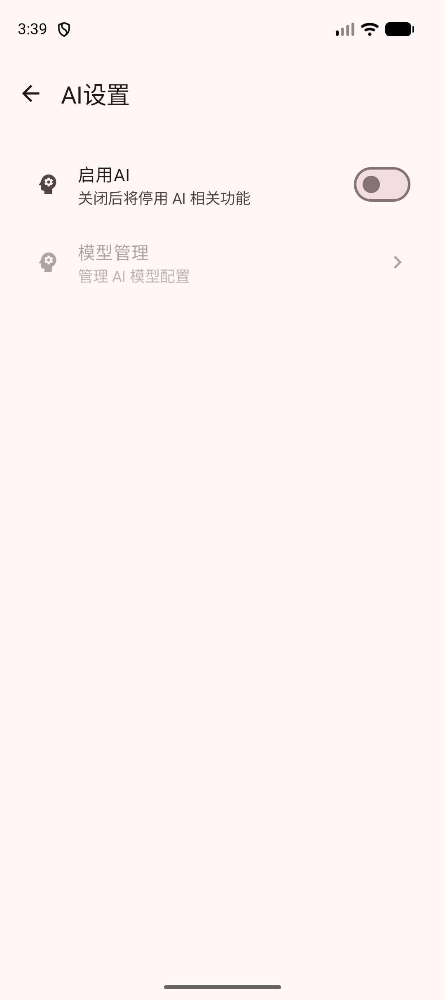
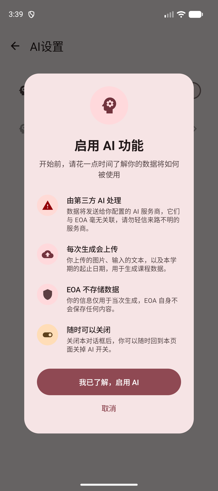

# 设置

想换主题、整理底部入口、重新同步，或者查看账号和应用信息，都可以从“设置”开始。

## 进入设置

在“概要”页面点击右上角的头像按钮，就能进入“设置”。

进入后，你会先看到自己的头像、姓名和专业信息。下面两个按钮最常用：

- **详细信息**：查看教务系统同步来的个人资料
- **登出**：退出当前账号并清理登录相关数据

再往下，就是各项设置入口：

- **外观**：调整主题、颜色、底部栏、小组件圆角和课程显示方式
- **同步**：设置自动同步间隔，或手动立即同步
- **AI管理**：管理可供课程辅助功能使用的 AI 模型
- **高级**：查看系统日志等调试功能
- **检查更新**：检查是否有新版本
- **问题反馈**：提交功能问题或使用建议
- **关于系统**：查看版本、作者、QQ群、邮件反馈、协议和源代码

::: warning
如果某个入口没有出现，通常不是页面出错，而是当前登录后端或当前平台不提供这项功能。先确认登录入口，再继续排查。
:::

::: tip
平时最常用的路径是：改界面进“外观”，更新教务信息进“同步”，遇到异常看“问题反馈”或“高级”。
:::

## 个人信息

点击“详细信息”后，可以查看教务系统同步下来的个人资料。

页面中通常会展示：

- 学号
- 姓名
- 学院
- 专业
- 邮箱
- 电话
- 身份证号
- 政策
- 语言

这些信息来自教务系统同步结果。如果内容不完整或没有更新，可以先回到同步设置中手动同步一次。

## 外观设置

想让应用看起来更像自己的习惯，可以进入“外观”。这里的设置会直接影响课表、概要页和底部导航。

### 系统主题

“系统主题”决定应用使用浅色、深色，还是跟着手机一起切换。

可选项包括：

- **浅色**：始终使用浅色界面
- **深色**：始终使用深色界面
- **跟随系统**：根据手机系统的深色模式自动切换

如果你不想每天手动切换，选择“跟随系统”就可以了。

::: warning
切换主题后，如果当前页面没有马上变化，可以先返回上一页再进入；不同设备的系统栏颜色也可能略有差异。
:::

### 主题色

“主题色”会改变按钮、强调文字、部分图标和小组件的颜色。内置颜色包括：姨妈红、闪耀橙、贝斯黄、风祝绿、拉格蓝。

如果内置颜色不合适，也可以选择“自定义”，手动挑选一个喜欢的颜色。

如果这些颜色都不合适，也可以选择“自定义”，自己挑一个颜色。

### 显示法定节假日课程

开启“显示法定节假日课程”后，课表页和概要页会保留法定节假日当天的课程。

如果假期里有补课，建议打开这个选项；如果只想看普通上课日，关闭即可。

::: warning
这个开关依赖应用拿到的校历节假日信息。学校临时调课或校历本身没有标记的日期，仍请以学校通知为准。
:::

### 底部栏定制

“底部栏定制”可以决定底部导航栏显示哪些入口，也可以调整它们的顺序。

通常可以选择：首页、课表、考试、绩点、二课、友链。

最多可以放 3 个常用入口，其他入口会收进“更多”。“首页”是基础入口，不能取消。

::: warning
可选入口会根据登录的教务系统变化。研究生教务系统当前不提供考试、绩点和二课入口，因此这些项目不会出现在底部栏定制列表或“更多”中。
:::

::: tip
如果底部栏看起来太拥挤，可以只保留自己每天会用的入口；其他功能仍然可以从“更多”进入。
:::

### 小组件圆角

::: warning
今日课程小组件同时支持 Android 和 iOS；但“小组件圆角跟随系统”是 Android 专属设置，iOS 小组件的圆角由系统自身控制。
:::

“小组件圆角跟随系统”会让桌面小组件尽量使用系统提供的圆角样式，使它和手机桌面上的其他小组件更协调。

如果你的手机系统无法正确提供圆角信息，可能会出现圆角看起来不自然的情况。此时可以关闭该选项。

::: warning
这个选项只影响桌面小组件，不会改变应用内课表卡片的圆角。
:::

### 隐藏周末课程

开启“隐藏周末课程”后，只有周六和周日都没有课程时，课表页才会隐藏周末列。

如果你周末也有课，或者想始终显示完整一周，可以关闭这个选项。

::: warning
如果你发现周末列不见了，先检查这里；它不会删除课程，只是把空的周末列暂时收起来。
:::

### 显示实验课提示

“显示实验课提示”用于控制概要页面是否显示本周实验课列表。

开启后，如果本周有实验课，概要页会更方便地提醒你。这个功能目前主要用于查看本周实验课，暂不支持查看整个学期的所有实验课。

::: warning
这里显示的是本周实验课提示，不是完整的学期实验课查询。
:::

## 关于系统

在“设置”页面点击“关于系统”，可以看到应用版本、作者和常用联系入口。

你可以在这里：

- 点击“赞赏我”，查看赞赏二维码；
- 点击“加入QQ群”，进入交流群；
- 点击“邮件反馈”，直接打开设备里的邮件应用；
- 点击“隐私政策与用户协议”，在应用内阅读两份文档；
- 点击“查看源代码”，打开项目主页。

::: warning
邮件和QQ群属于外部服务。发送日志、截图或问题描述前，请先检查内容里有没有密码、验证码、Token、Cookie、学号或其他不想公开的信息。
:::

### 阅读用户协议

点击“隐私政策与用户协议”后，会从底部打开阅读窗口。默认显示“用户协议”，页面顶部会显示更新日期和生效日期。

::: tip
协议内容较长，可以在窗口里上下滑动；看到日期发生变化时，建议重新读一遍与自己使用方式有关的部分。
:::

### 阅读隐私政策

点击顶部的“隐私政策”标签，就能切换到隐私政策。

::: warning
隐私政策会说明登录信息、课程数据、AI 请求、崩溃诊断和反馈内容分别会去哪里。尤其是使用 AI、邮件反馈或自动崩溃诊断前，请先看清对应部分。
:::

::: warning
关闭 AI 或崩溃诊断相关开关后，应用会隐藏或停止对应的自动功能；但你主动点击邮件、QQ群或其他外部入口时，仍需自己确认发送内容。
:::

## 同步设置

进入“同步”后，可以调整同步周期，也可以手动触发同步。

### 同步时长

“同步时长”表示应用同步成功后，下一次自动同步会间隔多少天。点击后可以在 1 到 30 天之间选择。

修改同步时长后，页面会提示“同步设置将会在重启后生效”。

页面还会显示距离下次同步还有多久。如果已经超过设置时间，应用会在下次启动时同步。

### 立即同步

“立即同步”用于强制重新获取教务系统中的最新数据。适合这些情况：

- 教务课表刚发生变更
- 成绩或考试信息刚更新
- 通知没有及时出现
- 本地数据看起来不是最新

同步正在进行时，按钮会显示“正在同步”，请等待完成。

::: tip
如果只是日常使用，不需要频繁手动同步。确认教务系统数据有变化但应用没有更新时，再通过[立即同步](./settings.md#立即同步)重新获取会更合适。
:::

### 同步异常

如果同步失败，页面会在“立即同步”下方显示失败原因。可以检查网络和登录状态后再试。

## AI 管理

### 启用 AI

打开“启用 AI”开关后，课程辅助功能才会生效。第一次打开时，会先弹出确认对话框；看完提示后，点击“我已了解，启用 AI”即可继续。

::: warning
启用 AI 后，你上传的图片、输入的文字和本学期起止日期，可能会发送到你配置的第三方 AI 服务商。EOA 与这些服务商没有关联，请先确认服务来源可信。
:::

::: warning
如果你暂时不需要 AI 功能，请保持开关关闭；关闭后，AI 相关功能会停止使用。
:::

### 管理 AI

“管理 AI”用于管理课程辅助功能要使用的模型。配置完成后，在支持 AI 的页面里就可以选择对应模型。

如果还没有添加过模型，页面会提示“暂无AI配置”。点击右下角的添加按钮，就可以新建一个模型。

已经添加的模型会显示在列表中。列表里优先显示“模型备注”，如果没有填写备注，就会显示“模型名称”。每个模型右侧可以进行编辑或删除。

列表中的小图标表示这个模型支持的能力：

- 图片图标：表示可以处理图片内容
- 代码图标：表示更适合返回结构清晰的结果

点击添加或编辑后，会打开模型信息窗口。

这里可以填写：

- **模型备注**：给自己看的名称，例如“日常使用”“识别课表图片”
- **模型简述**：简单说明这个模型适合做什么，方便以后选择
- **模型名称**：模型服务中对应的模型名
- **模型Key**：模型服务提供的访问凭证
- **Base URL**：模型服务地址

填写完成后点击“保存”。保存成功后，这个模型就会出现在模型列表中，也可以在支持 AI 的页面中被选择。

::: tip
如果你不使用 AI 辅助功能，可以不配置这里。模型Key通常由对应的 AI 服务提供，请妥善保管，不要随意分享给他人。
:::

::: warning
保存模型时，应用可能会向你填写的服务地址发送测试请求。请确认地址可信，并且不要在模型名称、备注或测试内容里填写密码等敏感信息。
:::

## 常见情况

个人信息不对：先尝试手动同步；如果学校教务系统本身信息未更新，应用内也会保持旧内容。

主题或颜色没有立刻变化：可以返回上一页再进入，或重启应用确认效果。

底部栏找不到某个功能：进入“外观”里的“底部栏定制”，检查是否把该模块取消了。

同步按钮不可点：通常是正在同步或应用还在初始化，稍等片刻即可。
