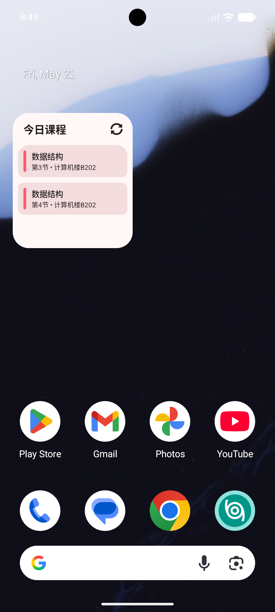

# 小组件

::: warning
小组件目前仅 Android 版本支持，iOS 版本暂不可用。
:::

小组件可以把当天课程直接放到手机桌面上。你不需要每次打开应用，也能快速看到今天有没有课、下一节是什么课、在哪个教室上课。

## 今日课程

目前提供的是“今日课程”小组件。

它会读取应用本地已经同步好的课表数据，并按照当天日期显示今天的课程安排。每门课通常会显示：

- 课程名称
- 第几节课
- 上课地点
- 当前正在进行课程的进度百分比

如果当前时间正好在某节课内，小组件会在对应课程右侧显示进度，方便你快速判断这节课已经进行到哪里。

如果今天没有课程，小组件会显示“今日无课程!”。

如果当前还没到学期开始，可能会显示“准备开学吧!”；如果已经在假期中，可能会显示“享受假期吧!”。

## 桌面查看

把“今日课程”添加到桌面后，就可以直接在桌面查看当天安排。

小组件上方会显示“今日课程”，右侧有刷新按钮。下方是今天的课程列表。

常用操作：

- 点击小组件空白区域：打开应用
- 点击某一门课程：进入该课程详情
- 点击右上角刷新按钮：手动刷新小组件内容

::: tip
小组件依赖应用内已经同步好的课表数据。如果桌面内容不对，建议先打开应用完成一次同步，再回到桌面刷新小组件。
:::

## 小组件样式

小组件会跟随应用的外观设置显示，包括主题色和明暗模式。

也就是说：

- 应用切换浅色/深色主题后，小组件也会尽量保持一致
- 修改应用主题色后，小组件的整体配色也会随之变化
- 每门课程左侧会有不同颜色的标记，方便快速区分课程

如果你调整了主题或颜色，但桌面小组件没有立刻变化，可以点击小组件右上角的刷新按钮，或等待系统自动刷新。

::: tip
小组件外观主要跟随[外观设置](./settings.md#外观设置)中的“主题色”“系统主题”和“小组件圆角跟随系统”。如果调整后桌面没有立刻变化，可以先刷新小组件或重新添加。
:::

::: danger
受限于 ROM 厂商以及 Android 本身限制，刷新按钮不会立即生效。如果你希望马上同步数据，移除并重新添加小组件即可。
:::

## 圆角设置

在 Android 版本的“设置”页面中，可以找到“小组件圆角跟随系统”。

开启后，小组件会尽量使用系统提供的桌面小组件圆角，让它和手机桌面上的其他小组件更协调。

关闭后，应用会使用自己的默认圆角样式。

建议：

- 如果小组件圆角显示正常，可以保持开启
- 如果圆角看起来奇怪、被裁切，或和桌面不匹配，可以关闭该选项

这个设置只影响桌面小组件的外观，不会影响课表数据本身。

## 常见情况

桌面找不到小组件：请确认你使用的是 Android 版本，并在系统桌面的小组件列表中查找“今日课程”。

小组件一直显示 Loading...：可能是系统还在加载，稍等片刻或点击刷新按钮。

小组件显示今日无课程：通常表示今天确实没有课，也可能是课表数据还没有同步完成。

点击刷新没有马上变化：这是 Android 系统的小组件刷新限制导致的，建议稍后再试，或打开应用确认数据是否已经更新。
